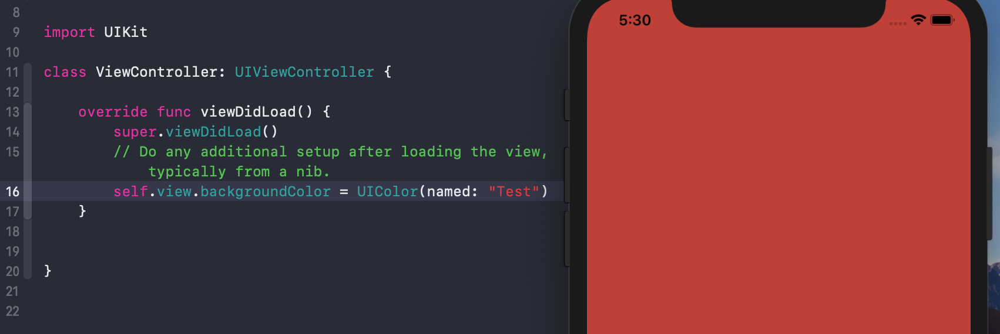

## 使用 Named UIColor

作者：[南峰子]()

从 `XCode 9` 开始，我们可以在工程中创建 `named color`，并在代码或 `Storyboard` 中使用。要创建 `named color`，只需要进入 `Assets.xcassets` 中，点击右键，出现图 1 的菜单，选择 `New Color Set`：

然后编辑 `named color` 的名称和色值等信息，如图 2 所示。

在代码中，我们可以直接使用 `UIColor(name: "Test")` 来使用，如图 3 所示。

