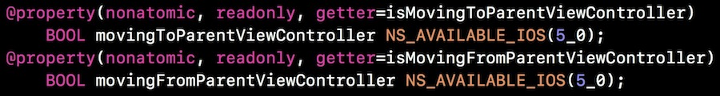
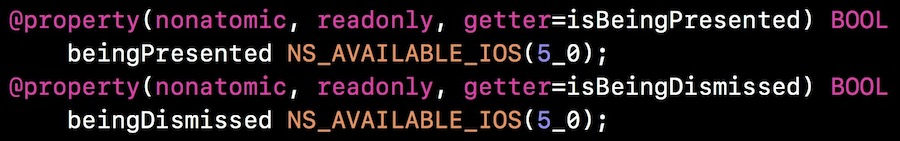

## 被大家忽略的UIViewController两对API

**作者**: [高老师很忙](https://weibo.com/517082456)

在某个页面被 pop 或者 dismissViewController 的时候，需要执行某个操作，大家会怎么做呢？swizzle dealloc 方法？这样做是没有问题的；其实 UIViewController 为我们提供了两对API。

针对 add childViewController 和 remove childViewController:

当然，Push 和 Pop 也是适用的。

针对 Present 和 Dismiss:

那前面提到的问题就可以在 viewWillDisappear: 或者 viewDidDisappear: 里面去判断 `self.beingDismissed` 或者 `self.movingFromParentViewController`。

虽然是 iOS5 之后就有了，但被很多开发童鞋忽略和遗忘了，有应用到的场景，大家可以用起来哈！

