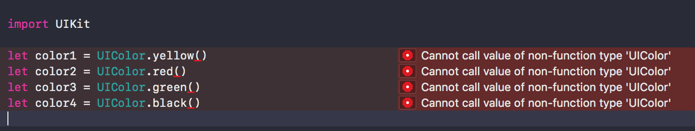
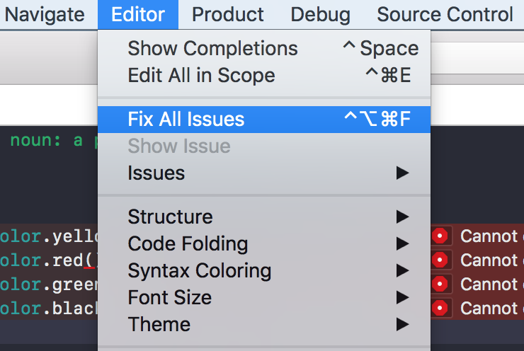
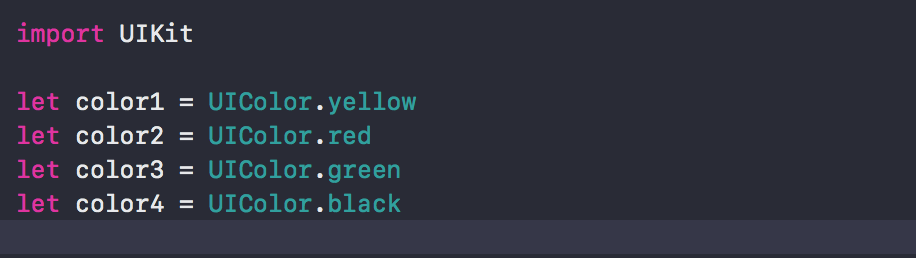

## Fix All issue

**作者**: [南峰子](https://weibo.com/touristdiary)

我们在写代码时，可能不经意没有通过 Refactor -> Rename 修改了某个方法名，或者类似于 Swift 这种破坏式升级，或者其它各种原因，而造成多个多个错误。

Xcode 为我们提供了一个功能：Fix All Issues，只要 Xcode 知道问题在哪，就可以通过这种方式一次性解决这些问题。

