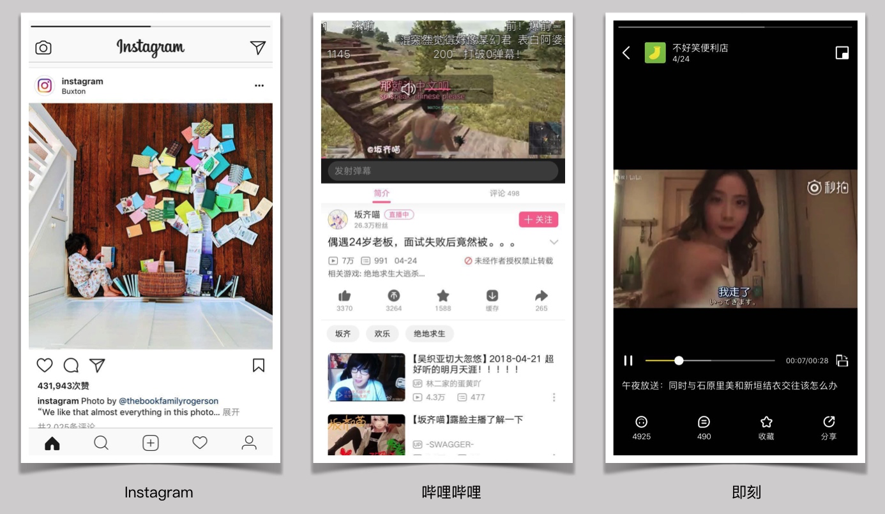

## 替换系统音量提示

**作者**: [Vong_HUST](https://weibo.com/VongLo)

相信平时大家在用 `iPhone` 看视频调节音量时，总会被系统的音量提示所打扰，因为它会遮住一部分内容。所以很多视频应用都使用自定义音量视图的方式来替代系统的音频。比如下面三张截图，分别来自 `Instagram`、哔哩哔哩、即刻



其实要实现这个，主要是实现下面几个要点

- 激活 `AudioSession`
- 创建一个 `MPVolumeView`，并将其添加到当前可见的视图层级当中，同时将其 `frame` 设置到不可见区域
- 监听音量按钮触发事件，改变音量提示（监听方式有两种：`KVO`、`NSNotification`）

代码分别为

```objc
// KVO
- (void)dealloc {
    [[AVAudioSession sharedInstance] removeObserver:self
                                         forKeyPath:NSStringFromSelector(@selector(outputVolume))];
}

- (void)addObserver {
    [[AVAudioSession sharedInstance] addObserver:self
                                      forKeyPath:NSStringFromSelector(@selector(outputVolume))
                                         options:NSKeyValueObservingOptionNew
                                         context:nil];
}

- (void)observeValueForKeyPath:(NSString *)keyPath
                      ofObject:(id)object
                        change:(NSDictionary<NSKeyValueChangeKey,id> *)change
                       context:(void *)context {
    if ([change isKindOfClass:[NSDictionary class]]) {
        NSNumber *volumeNum = change[@"new"];
        if (volumeNum) {
            [self volumeDidChange:[volumeNum floatValue]];
        }
    }
}

- (void)volumeDidChange:(CGFloat)volume {
    // 显示自定义音量提示
}

```

```objc
// Notification
static NSNotificationName const kSystemVolumeDidChangeNotification = @"AVSystemController_SystemVolumeDidChangeNotification";

- (void)dealloc {
    [[NSNotificationCenter defaultCenter] removeObserver:self];
}

- (void)addObserver {
    [[NSNotificationCenter defaultCenter] addObserver:self
                                             selector:@selector(volumeDidChange:)
                                                 name:kSystemVolumeDidChangeNotification
                                               object:nil];
}

- (void)volumeDidChange:(NSNotification *)notification {
    NSString *category = notification.userInfo[@"AVSystemController_AudioCategoryNotificationParameter"];
    NSString *changeReason = notification.userInfo[@"AVSystemController_AudioVolumeChangeReasonNotificationParameter"];
    if (![category isEqualToString:@"Audio/Video"] || ![changeReason isEqualToString:@"ExplicitVolumeChange"]) {
        return;
    }

    CGFloat volume = [[notification userInfo][@"AVSystemController_AudioVolumeNotificationParameter"] floatValue];
    // 显示自定义音量提示
}
```

- `KVO` 在音量调节至最大/最小时，这个时候再调大/调小音量，由于 `outputVolume` 的值不变，所以不会触发 `KVO`，也就无法展示自定义音量视图，
- 监听系统私有(未公开的)通知，名字是 `AVSystemController_SystemVolumeDidChangeNotification`，这个监听不会受到最大/最小音量时，调大/调小音量的影响，只要音量键按下，始终都会触发。但是这个通知由于是私有的，可能存在被拒风险，而且将来系统版本该通知名字发生改变，由于是硬编码而不像其它系统通知使用的是常量，会导致监听不到的问题。

#### 参考

[VolumeBar](https://github.com/gizmosachin/VolumeBar)

