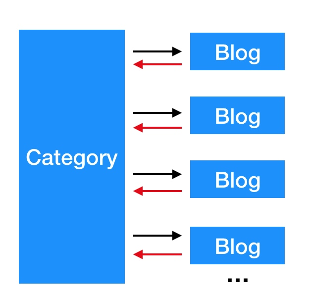
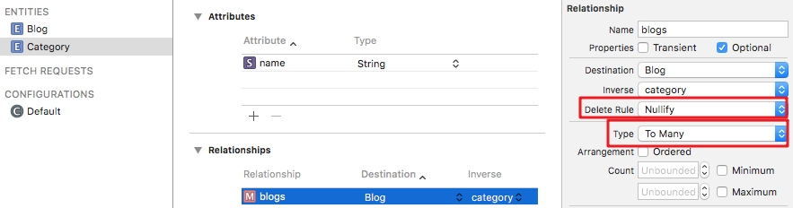

## CoreData 关系的4种删除规则

**作者**: [Vong_HUST](https://weibo.com/VongLo)

由于项目是基于 `CoreData` 的，所以 `CoreData` 方面遇到的问题比较多。今天主要为大家分享一下 CoreData 中关系的4种删除规则。

先假设我们有两个实体，`Blog` 和 `Category`，一篇 `Blog` 只能属于一个 `Category`，一个 `Category` 可以有多篇 `Blog`。如图:

1.**No Action**

规则为 `No Action` 时，当 `category` 删除时， `blogs` 是不会被通知到的，由于 `CoreData` 里关系是双向的，`blog` 这边依然认为他被关联到对应的 `category`。这种规则到目前还没用到过，也没有具体的使用场景，如果设置成 `No Action`，如果操作不当，可能会有崩溃发生。

2.**Nullify**

还是拿上面举例，如果 `category` 被删除，`blog` 对应的 `category`  关系会被置为 `nil`。这个是系统默认删除规则，也是日常中用的最多的删除规则。

3.**Cascade**

`Cascade` 规则某些场景下也十分有用。还是用上面例子，一般情况下，我们想 `category` 被删除之后，其拥有的所有 `blog` 实例也要删除，那这个时候直接将删除规则设置成这个即可。`CoreData` 在 `category` 删除后会自动将其关联的 `blog` 也全部删除。但这种情况一般只存在与一对多(或一对一)的情况，如果是多对多，就不适合用这种规则。

4.**Deny**

这个规则刚好和 `Cascade` 相反，`category` 只有在其所拥有的 `blogs` 都被删除的情况下才会被删除。这种情况在我们项目中，也没有具体使用场景。

综上，一般业务场景下 `Nullify` 和 `Cascade` 规则已经可以满足。如果有其他特殊场景也可以考虑1和4。欢迎补充和讨论~

