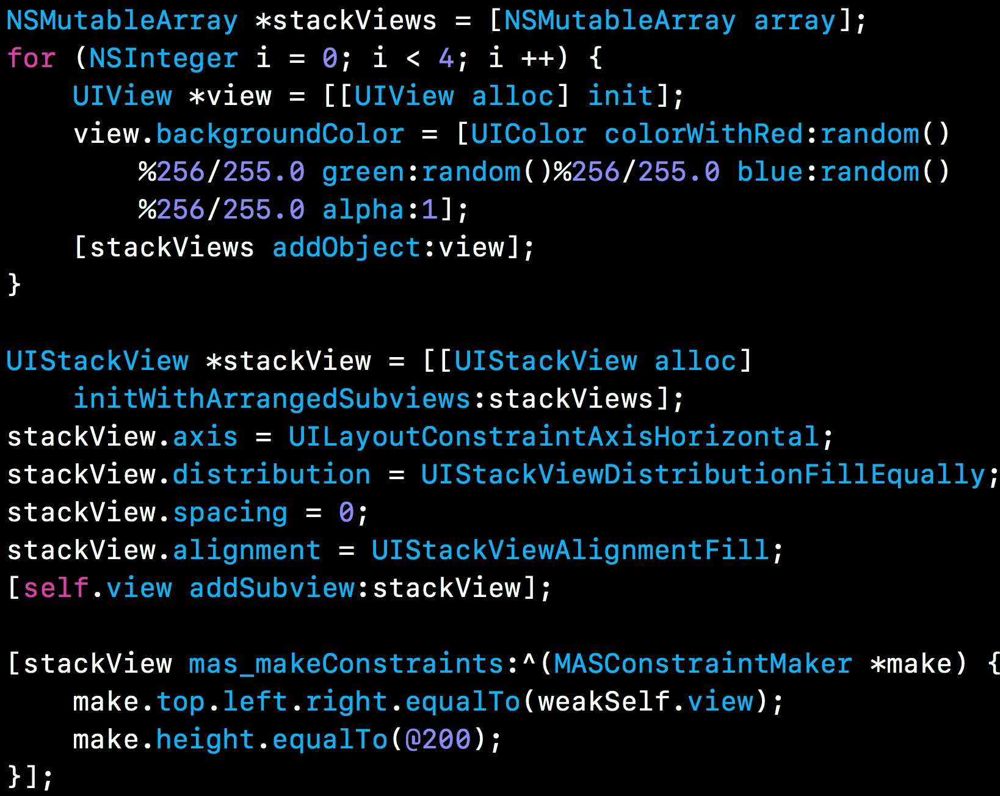
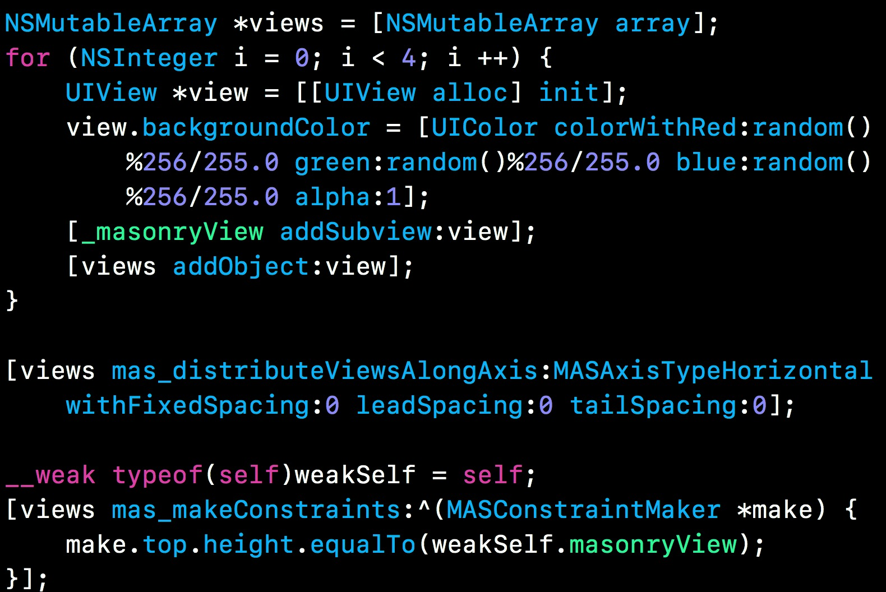

## 水平可者竖直布局方案

**作者**: [高老师很忙](https://weibo.com/517082456)

如果想实现上图这种水平布局，大家会采取哪些技术方案呢？一些常规操作我就不介绍了，我主要是介绍2种比较方便的解决方案，可以适用于固定个数的子视图和不确定个数的子试图（eg:根据接口返回显示子视图的个数）。

首先推荐 `iOS9` 之后推出的 **UIStackView**，使用比较方便，嵌套使用也比较方便，如果是在 `xib` 或者 `Storyboard` 直接拖几个控件，设置一下属性就可以实现上面的效果，如果手动 `Coding` 的话也很简单，如图：

另一个方案是 **Masonry** 库封装的方法，这种布局也可以轻松实现，如图：

