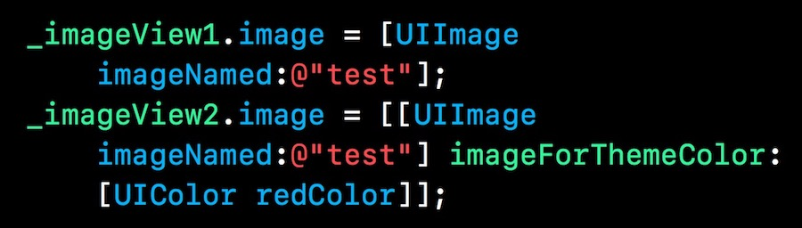
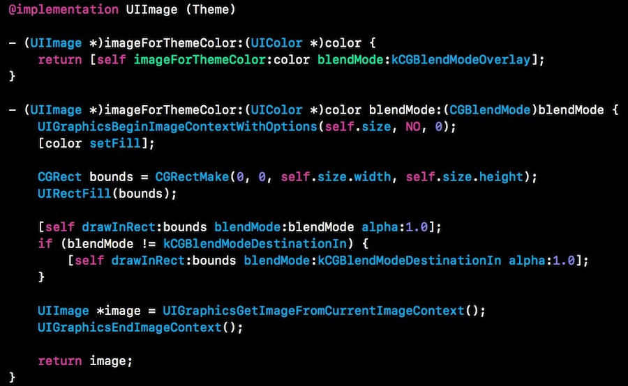
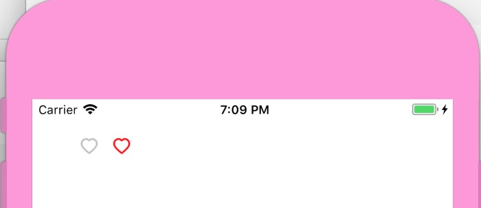

## 为icon换装

**作者**: [高老师很忙](https://weibo.com/517082456)

最近一直在研究怎么减少资源文件，如果产品童鞋要用不同颜色的图片展示不同的状态，状态 A 是绿色的，状态 B 是红色的，状态 C 是黄色，图案都是一样的，只是颜色不同，也许你会让设计童鞋切3张图，但这种方式不太优雅。

有两种方案：一个是使用 `tintColor`，可以简单的实现更换颜色；如果这个方法不能满足需求，可以使用绘制的方式，可选参数会多很多。喵神之前发表过一篇文章——**《iOS中使用blend改变图片颜色》**很是受用，虽然发表时间有点早，但我个人觉得还是比较实用。

我们可以使用 `UIImage` 的 `-drawInRect:blendMode:alpha:` 方法，封装后一行代码搞定你想要的任何颜色，直接上代码：

运行效果如图：

`kCGBlendModeDestinationIn` 是保留透明度信息；但如果图片中有阴影就需要与 `kCGBlendModeOverlay` 或者 `kCGBlendModeMultiply` 或其它参数根据实际情况叠加使用。

喵神已经把原理讲解的很详细了，感兴趣的童鞋可以移步：`https://onevcat.com/2013/04/using-blending-in-ios/`

