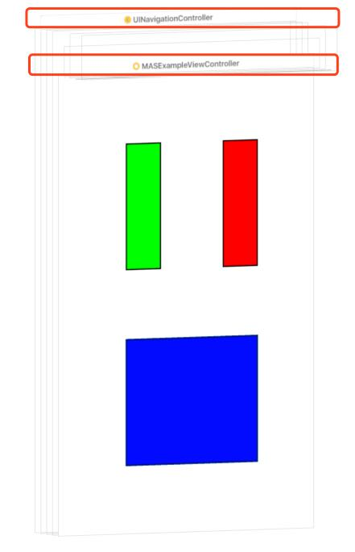
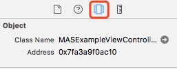
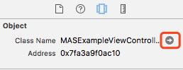

## Xcode 9 中快速定位目标控制器

**作者**: [moon2light](https://weibo.com/u/2565466125)

你有没有这种困扰，接手一个老项目或项目目录结构复杂的时候，我们要修改某个控制器的界面/功能时，控制器的定位就有些许困难。苹果爸爸很早就意识到这个问题了，也一直在优化这里，今天就分享一下该 `UI` 调试小技巧。

充分条件:

1. `Xcode 9.0` 及以上
2. 模拟器/真机 `iOS 11.0` 及以上

过程:

1.模拟器/真机定位需要调试的界面.
2.定位到 `debug` 工具 -> 点击 `debug view hierarchies`。

3.轻转一下视图层次,就可以看到整个的页面的层次结构,今天的重点在这里,控制器实例。

4.点击控制器实例(上图红框部分),看 `Xcode` 右侧 `show the object inspector`。

5.当当当~是不是感觉到类名很熟悉,点击右侧小箭头,就会跳转到对应控制器的 .h 文件。

6.`command+shift+j` 文件导航栏中定位文件,找到 `.m` 文件,  `enjoy debugging`。

