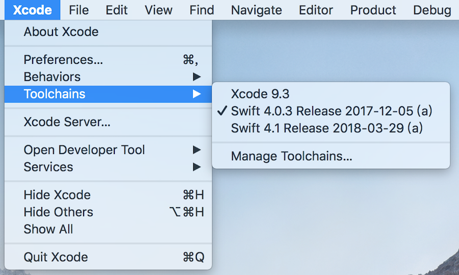
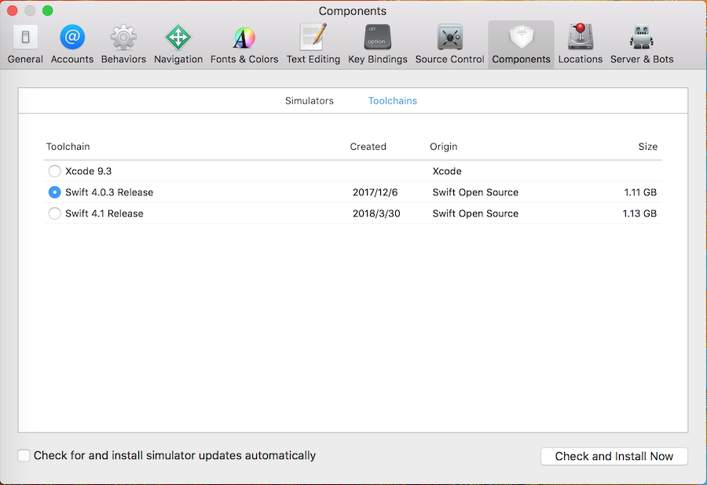

## 使用 Toolchains 在 Xcode 中切换 Swift 版本

我们每次安装新版本的 `Xcode` 的时，新 `Xcode` 都只包含最新版本的 `Swift`。但通常我们的代码或第三方库还来不及匹配，或者我们想看看新的特性在新旧版本之间的区别，这时候就比较头大了。

苹果爸爸给的解决方案是：`multiple Swift toolchains`。每个版本的 `Swift` 都可以单独下载安装。我们可以在 `Swift` 官方博客上下载：https://swift.org/download/#releases。每个 `toolchain` 都是一个 `.pkg` 安装包。我们下载安装完成后，重新启动 `Xcode`，就可以在 `Xcode` 的菜单上找到 `toolchains` 了。

另外，我们也可以在 `Preference -> Components: Toolchains` 面板里面来管理 `Toolchains`，如切换、删除等。

需要注意的是，`Xcode` 自带的默认的 `toolchains` 不能被移除。

