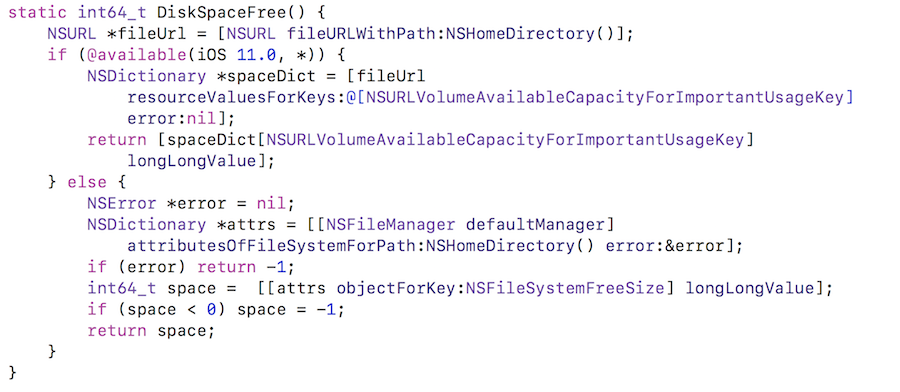

## iOS 11 后还使用旧方法获取设备剩余空间？

**作者**: [Lefe\_x](https://weibo.com/u/5953150140)

**iOS11**

`iOS11` 以后使用 `NSHomeDirectory()` 这种方式获取手机剩余空间总是不准，经测试差不多少 `2G` 左右，最后查文档后发现 `iOS11` 后苹果新增了 `API`。 所以 `iOS11` 以后需要使用新的 `API` 才能获取到真实的剩余空间，不过 `BYTE` 转换为 `KB` 的时候苹果使用的是 `1000`，而腾讯视频使用的是 `1024`。

> The query type to use depends on what's being stored. If you’re storing data based on a user request or resources the app requires to function properly \(for example, a video the user is about to watch or resources that are needed for the next level in a game\), query against `NSURLVolumeAvailableCapacityForImportantUsageKey`. However, if you’re downloading data in a more predictive manner \(for example, downloading a newly available episode of a TV series that the user has been watching recently\), query against `NSURLVolumeAvailableCapacityForOpportunisticUsageKey`.

* `NSURLVolumeTotalCapacityKey`获取到整个手机的存储空间，比如32G的手机获取的数据是32G；

* `NSURLVolumeAvailableCapacityKey` 可用容量；

* `NSURLVolumeAvailableCapacityForImportantUsageKey` 苹果建议如果下载视频或者游戏下一关的数据用这个，经调查发现系统中的剩余空间和腾讯视频使用的都是这个；

* `NSURLVolumeAvailableCapacityForOpportunisticUsageKey`苹果建议如果您以更具预见性的方式下载数据（例如，下载最近使用的一个电视系列节目，用户最近一直在观看）。

**iOS11以前**

`iOS11` 以前获取的手机剩余空间总是多余系统中的剩余空间。我手机系统是`iOS9.3.1` 获取到的剩余空间差不多为 `7.98G`，而系统显示为 `7.8G`，比系统获取的还要多，而且不确定苹果使用的是 `1000` 还是 `1024` 进行转换，如果使用 `1000` 转换的话，那么我获取到的剩余空间会比系统显示的剩余空间还要大。如果我用 `1000` 转换，大约为 `8.56GB`。

#### 参考链接

[Checking Volume Storage Capacity](https://developer.apple.com/documentation/foundation/nsurlresourcekey/checking_volume_storage_capacity?language=objc)

