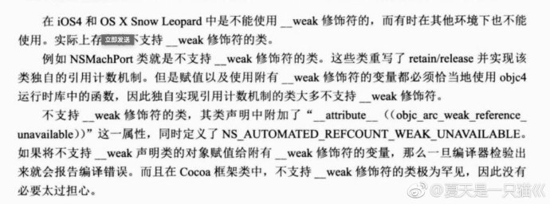
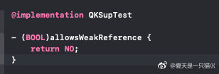
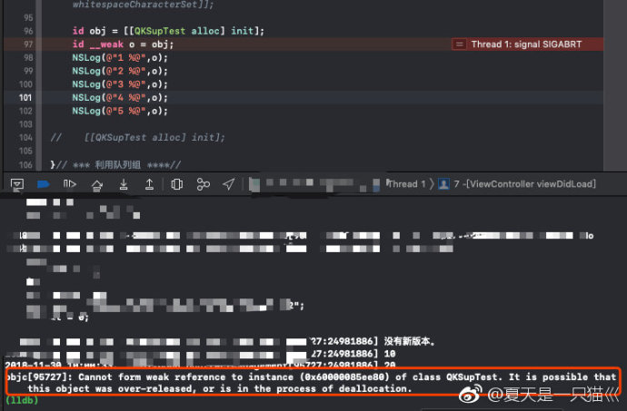
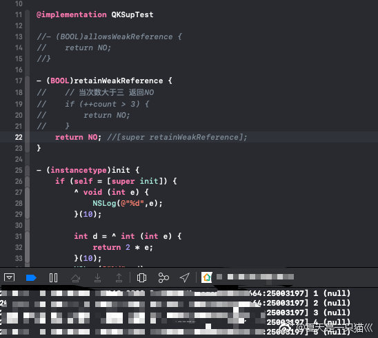

## 不支持 __weak 修饰的类

**作者**: [夏天是一只猫巛](https://weibo.com/u/3164113847?refer_flag=1005055010_&is_hot=1)

如 `NSMachPort`。另外自定义的类实现了 `allowsWeakReference/retainWeakReference` 实例方法返回 NO(默认返回YES)也不能用 `__weak` 修饰。`allowsWeakReference` 返回 NO 后，使用后会异常终止。如下图：

使用 `retainWeakReference` 返回 NO 后不会崩溃，但是 `__weak` 值为null，如下图。也可以在在该方法内部控制对象的 `weak` 次数。

