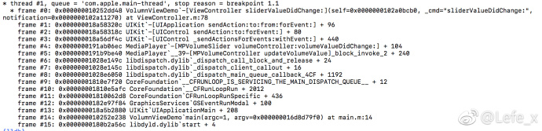
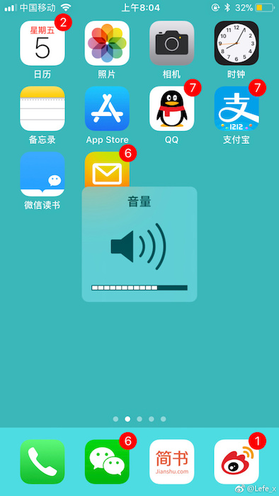

## iOS 中音量控制解惑

**作者**: [Lefe_x](https://weibo.com/u/5953150140)

`iOS` 中音量中其实也有好多小窍门，这个小集帮你解惑。`iOS` 中主要有 2 个地方可以控制音量，一个是系统音量，用户主动按音量键，调整音量，这种方式会显示系统音量提示框；另一个是播放器的音量，比如通过 `AVAudioPlayer` 调整音量，这种不会显示系统提示音量框。

### 如何调节音量时不显示系统音量提示框

主要原理就是获取系统音量 `View`，并把它让用户不可见。但注意一点，你不能把 `MPVolumeView` 的 `hidden` 属性设置为 `YES`，这样导致的结果是用户调整音量时任然会显示系统音量提示框，如下代码所示。

```
_volumeView = [[MPVolumeView alloc] initWithFrame:CGRectMake(100, 100, 100, 100)];
_volumeView.backgroundColor = [UIColor yellowColor];

// 如果设置了 Hidden 为 YES，那么修改音量时会弹出系统音量框
_volumeView.hidden = NO;
_volumeView.alpha = 0.01;
for (UIView *view in [_volumeView subviews]){
if ([view.class.description isEqualToString:@"MPVolumeSlider"]){
    self.volumeSlider = (UISlider*)view;
    break;
   }
}
[self.view addSubview:_volumeView];
```

### 获取系统音量

方法一：通过 `self.volumeSlider` 获取

如果想获取系统音量，可以通过第一种方式，`self.volumeSlider.value` 来获取，但是你发现第一次为 0，这很纠结，这样导致的结果就是获取的系统音量不准确。这是因为初始 `MPVolumeView` 时，`volumeSlider.value` 还没有赋值，如下图所示：



可以发现，音量是后来通过 `[MPVolumeController updateVolumeValue]` 来更新的。所以我们可以通过监听 `self.volumeSlide` 值改变时的事件，达到获取系统音量的目的。

```objc
[self.volumeSlider addTarget:self action:@selector(sliderValueDidChange:) forControlEvents:UIControlEventValueChanged];
```

方法二：通过 `AVAudioSession` 获取

```objc
[[AVAudioSession sharedInstance] outputVolume];
```

这种方法直接了当。

### 自定义音量控件

如果想自定义音量控件，可以监听音量的变化，并且通过第一种方法隐藏系统音量提示框。通过监听通知，达到监听音量变化的效果。

### 监听音量变化

监听音量变化，通过监听通知 

```objc
AVSystemController_SystemVolumeDidChangeNotification

[[NSNotificationCenter defaultCenter] addObserver:self selector:@selector(volumeChanged:) name:@"AVSystemController_SystemVolumeDidChangeNotification" object:nil];
```

最终结果 `AVSystemController_AudioVolumeNotificationParameter` 表示音量的值，这里需要注意的是 `"AVSystemController_AudioVolumeChangeReasonNotificationParameter" = ExplicitVolumeChange;` 这个值，它会由于不同的场景，有不同的值。`ExplicitVolumeChange` 是用户点击音量按钮，`CategoryChange` 是用户按 `home` 键调起 `Siri`，`RouteChange` 这个时路线修改（不太清楚，什么情况下触发的）。

```objc
AVSystemController_SystemVolumeDidChangeNotification; object = <AVSystemController: 0x1c4001dc0>; userInfo = {
    "AVSystemController_AudioCategoryNotificationParameter" = "Audio/Video";
    "AVSystemController_AudioVolumeChangeReasonNotificationParameter" = ExplicitVolumeChange;
    "AVSystemController_AudioVolumeNotificationParameter" = "0.5625";
    "AVSystemController_UserVolumeAboveEUVolumeLimitNotificationParameter" = 0;
}}
```

### 注意点

如果通过代码修改了 `self.volumeSlide` 的 `value`，那么会显示出系统音量框，如果你发现某个页面突然蹦出一个系统音量框，原因大多数是你修改了这个值。



