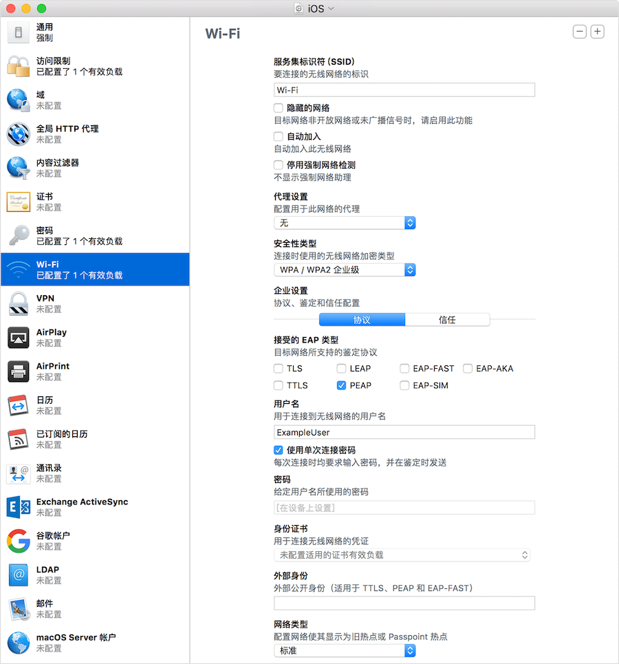
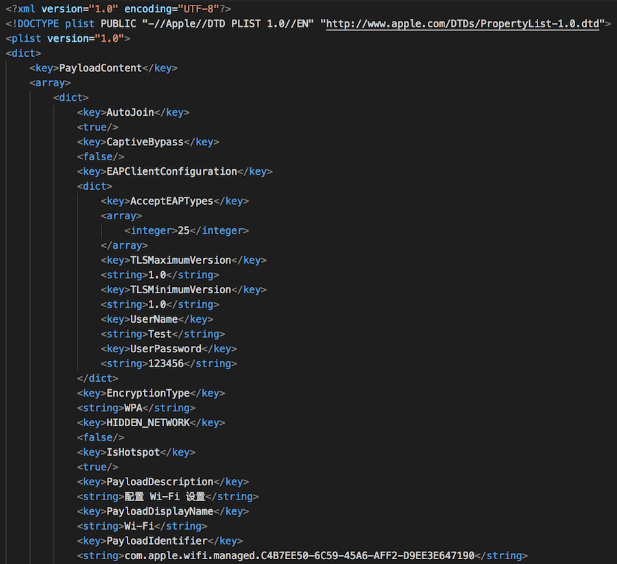
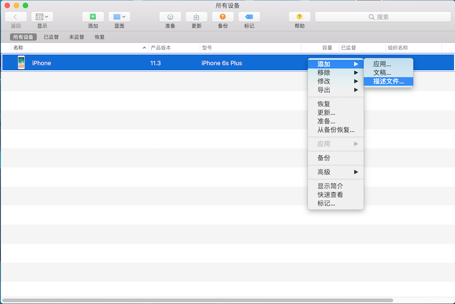

## 使用 Apple Configuration 配置自动加入 Wi-Fi

**作者**: [南峰子_老驴](https://weibo.com/touristdiary)

通常我们的 `iPhone` 手机都会自动连接已经记住的 `Wi-Fi` 网络，对于一些企业级的 `WPA/WPA 2` 网络，如果不能自动加入的话，我们可以自己配置一个 `Wi-Fi` 描述文件来做自动加入。

我们可以使用 “`Apple Configuration`” 或者 “描述文件管理器” 来生成配置文件，如下图是使用 “`Apple Configuration`” 来配置（文件 -> 新建配置文件），当然我们需要知道 `Wi-Fi` 实际的配置，比如网络协议接受的 `EAP` 类型。

配置完成后保存成一个 `.mobileconfig` 文件，这实际上是一个 `xml` 文件，内容如下图所示。因此，我们实际上是可以通过代码的形式来生成这个文件。

生成的 `.mobileconfig` 文件可以使用 “`Apple Configuration`” 导入到手机里面，如下图所示。

剩下的就是在手机上正常安装描述文件的流程，需要进到 “设置 -> 通用 -> 描述文件” 里面安装这个描述文件。安装完成后，就可以自动连接 `Wi-Fi` 了。

需要注意的几个问题：

1. 如果想输入密码，可以勾选“使用单次连接密码”，不过这个选项不能和“自动加入”同时使用；如果两个都勾选会默认使用“使用单次连接密码”；
2. 可以对配置文件做签名，但如果签名后，文件将不能再做修改；同时保存的文件内容变成16进制数据，所以也不能像修改 `xml` 文件那样手动修改文件；
3. 未签名的 `xml` 文件，是以明文的形式保存密码；
4. 如果需要证书认证，则要将相应的证书配置到描述文件中；
5. 在线安装描述文件的方式仅限于 `Safari`、`Mail`；
6. 使用 `portal` 方式认证的登录木有验证过；

#### 参考

[关于“自动加入”和单一连接密码 Wi-Fi 描述文件设置](https://support.apple.com/zh-cn/HT202343)

