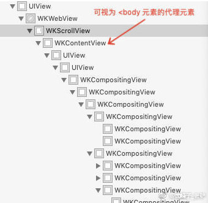

## 研究 WKWebview 的子 view 和 html body 的关系

**作者：** [hite和落雁](https://weibo.com/n/hite%E5%92%8C%E8%90%BD%E9%9B%81?from=feed&loc=at)

这个问题来自需求：当 `webview` 下拉 `bounce` 的时候，在漏出的部分显示自定义的 view。类似在微信打开一个公众号后显示的`“此页面由 **** 提供”`，这样的交互。

中间经过若干测试，实现此功能有三个关键点；

1. 设置 `webview.scrollView.backgroundColor = [UIColor clearColor];` 目的为了下拉整个页面时，能够漏出我们自定义 view。（这里需要指出的是，下拉页面出现 `bounce` 效果时，漏出的 是 `wkscrollview`；为什么这样，我猜测是因为 Safari 渲染的时候，bounce 效果是出在 `wkscrollview`上，可参看这个[测试页面](http://hite.github.io/raw.html)，请在 Safari 里打开）
2. 结合 1，将这个自定义 view，放在 `WKWebview` 和 `WKScrollView` 之间（猜测，`webview.scrollView` 是 `WKScrollView` 的代理对象，而 `WKScrollView` 是 <body> 的代理元素，是否真的这样需要看看源码）。
3. 添加自定义 view 到 `WKScrollView` 里的时机是
 `- (void)scrollViewWillBeginDragging:(UIScrollView *)scrollView`，
而不是 
`- (void)webView:(WKWebView *)webView didFinishNavigation:(WKNavigation *)navigation`
因为不同页面书写方式，导致有些样式会生效时机不同，页面加载完毕并不是个很好的时机。

在生成 webview 的时候，设置 `webview.scrollView.backgroundColor = [UIColor clearColor];`  。**特别的需要说明下**，当 h5 在 body 上写内联样式 `<body style="background-color:red">;` 或者写 style 样式；或者外联 `<link rel="stylesheet" href>`  三种写法，去设置 body 的颜色，是否生效看不同的情况；

1. 当设置的 body 颜色是 `#ffffff` 白色时，不论什么时候去设置 body 颜色都不会覆盖  `webview.scrollView.backgroundColor ` 的颜色。
2. 当设置的颜色是**非白色**时，会覆盖 `webview.scrollView.backgroundColor 
`

通过对照 `HTML` 的 `DOM` 层级和 `WKWebview` 的层级，

有以下发现；

1.  html 里下拉时， bounce 效果后面的背景元素是  `WKScrollView `，所以设置 body 颜色会设置到 `WKScrollView ` 的背景色。
2.  html 里其他元素全部由 `WKContentView` 嵌套。当整个页面是长页面需要分页时，会分多个 `WKCompositingView` 逐个显示；

使用上述方案实现下拉时显示自定义元素有个问题；

1. 在开始滑动 `scrollView` 时候，设置  `webview.scrollView.backgroundColor ` 的颜色，会将 h5 自己设置的背景色覆盖，所以 h5 要尽量不要依赖 body 的背景色做滑动背景；
2. 某些页面，如[测试页面2](http://hite.github.io/simple.html), 头部有个 `fixed
` 元素，下拉时也会漏出 bounce 背景色。此时如果背景色设置透明后出现一个很奇怪的 漏出，这时候不应该漏出。如果解决这个问题呢，如果真的要解决这个问题，可能需要去读 html 的样式，这样就比较麻烦了。
3. 对问题 2 ，有个讨巧的方案就是将漏出的自定义元素放在  `fixed
` 元素的后面，如微信那样。具体样式可以将 [测试页面2](http://hite.github.io/simple.html) 放到微信里看效果。

如果真正要解决问题 2 ，目前还需要再找找方案，希望看到 `webkit2` 的源码后能有方案。

