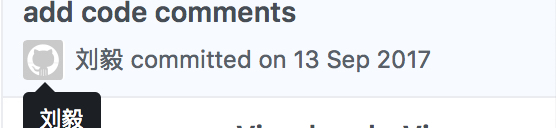
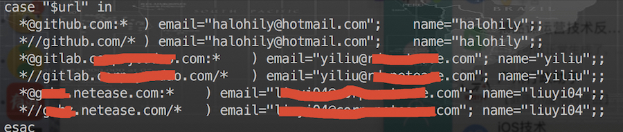

## 利用 Git-hook 自动配置不同仓库的用户信息

**作者**: [halohily](https://weibo.com/halohily)

> 问题的起因来自于某天一位同学的问题：“我给一个知名开源项目提交了代码，也被合并了，为什么 `contributors` 里面没有我？”其实，这多是因为提交代码时本地仓库的`user.name`、`user.email`与GitHub账号不匹配导致，只有提交代码时的用户设置与自己的 `GitHub` 账号相匹配时，各项数据才会被 `GitHub` 计入统计。如下图所示，这样的 `commit` 记录便来自于一个用户设置和我 `GitHub` 账号不匹配的本地仓库。

如果你不仅使用 `GitHub` ，还会向公司自建的 `GitLab` ，以及 `oschina` 、`coding.net` 等基于 `Git` 的托管服务商提交代码，那么便会面临这个问题：你需要为不同来源的 `Git` 仓库一一配置用户名与邮箱信息，来避免上述的不同步情况。然而，手动在每个本地仓库路径下都使用 `git config user.name` 和 `git config user.email` 命令，难免会有忘记的情况，也过于繁琐。所以，我们可以使用**Git初始模板、钩子函数**的特性，达到在**每次clone一个新的仓库时，根据仓库来源域名的不同，自动配置不同的用户信息**。

* 首先，在命令行使用该命令建立一个新的文件夹：`mkdir -p ~/.git-templates/hooks`

* 然后配置git，让git知道这个文件夹是你的模板文件夹：`git config --global init.templatedir ~/.git-templates`

* 接下来，在这个文件夹中新建钩子文件：`vi ~/.git-templates/hooks/post-checkout`

  钩子文件的内容较长，可在文末附带的链接中查看复制即可，完成之后赋予这个文件可执行权限：`chmod +x ~/.git-templates/hooks/post-checkout`

* 最后，新建一个文件：`vi ~/.git-clone-init`

  最后一个文件是唯一一个内容需要自己配置的文件，也是整个过程的关键，内容格式如图2，意为对应不同域名下的仓库，自动配置不同的`user.name`和`user.email`。

**整个过程的原理就是我们在执行克隆操作时，git会执行初始模板里的钩子文件，钩子文件根据git-clone-init文件定义的规则，自动配置用户名与邮箱信息。这套流程来自于一个GitHub开源库，目前star还很少，大家可以去支持一下~**

#### 参考链接

1. [DrVanScott/git-clone-init](https://github.com/DrVanScott/git-clone-init)
2. [让你的git拥有不同身份](https://segmentfault.com/a/1190000013283182)

