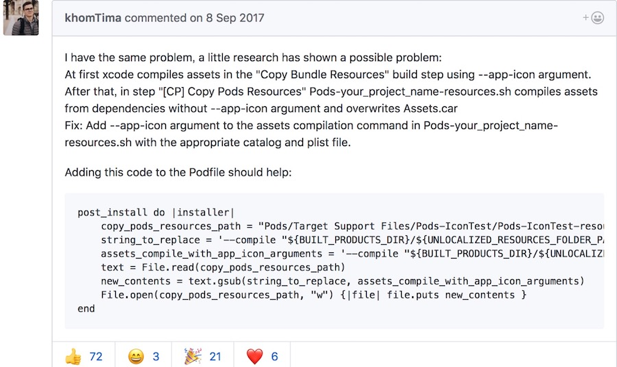

## 应用 icon 被 Cocoapods “吃掉”的解决方式

**作者**: [Vong_HUST](https://weibo.com/VongLo)

最近在做模块化相关的事情，和 `Cocoapods` 频繁接触，也踩了一些坑，今天主要分享一下最近遇到的一个 `bug`。

做模块化的时候，不同模块会有一个自己独立的 `repo`，然后有自己的各种资源，我们采取的方式是将图片放到 `.xcassets` 文件夹中，然后打到 `bundle` 当中，大概方式如图：

放到 `bundle` 的 `.xcassets` 是为了防止图片和主工程或者其它模块中图片重名

`run` 起来，一切图片等资源读取非常正常（资源的读取感觉后面有机会再写一篇文章单独介绍了），但是当我们 `Home` 出去的时候，发现应用的 `icon` 没了，变成了默认的那种空白图标😂，WTF！

果断到 `CocoaPods` 官方 `repo` 中寻求一波援助，发现有人提了类似的 [issue](https://github.com/CocoaPods/CocoaPods/issues/7003) 有人提出了一种解决方案，亲测可行。

原因是 `Xcode` 在 `"Copy Bundle Resources"` 阶段编译 `.xcassets` 加了 `--app-icon` 参数，而 `"[CP] Copy Pods Resources"` 阶段没有加这个参数，而且覆盖了编译出来的 `Assets.car`。解决方式就是在第一步加上这个参数。解决方式如下图，在 `podfile` 中加入参考链接中的脚本内容。

还有一种解决方案就是把图片全部放到 `bundle`，不放在 `.xcassets` 的形式，也是亲测可行。但是这种方式不太优雅，因为可能导致图片重名，读取错误。

#### 参考

1. [issue 解决方案](https://github.com/CocoaPods/CocoaPods/issues/7003#issuecomment-328045681)
2. [resource_bundles or resources](http://zhoulingyu.com/2018/02/02/pod-resource-reference/)

