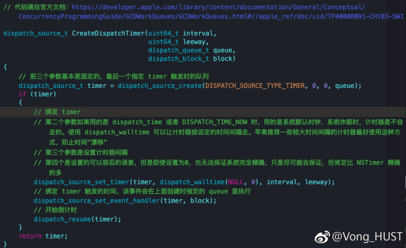

## 另一种形式定时器

**作者**: [Vong_HUST](https://weibo.com/VongLo)

从上一条 `@Lefe_x` 的分享我们知道 `NSTimer` 需要配合 `runloop` 使用，而且它计时是不精确的，同时处理不当的情况下会存在循环引用的情况。

今天和大家分享一下基于 `GCD` 的 `Timer`，它能解决掉刚刚提及到的 `NSTimer` 的三大问题。先来看一段示例代码，如图，具体解释已经包含在图中了。

但是使用 `dispatch_suspend`、`dispatch_resume` 这两个方法需要注意配对使用，不然可能会有意想不到的“惊(崩)喜(溃)”。值得一提的是 `dispatch source` 并没有提供用于检测 `source` 本身的挂起计数的 `API`，也就是说外部无法得知当前 `source` 状态。还有就是创建 `timer` 最好被持有，不然 `dispatch_suspend` 之后，如果没有被持有的话，就会 `crash`。

当 `dispatch_cancel` 调用后，这个 `timer` 就失效了，类似 `NSTimer` 的 `invalidate`。

关于 `GCD Timer` 推荐一个开源库: `SwiftTimer https://github.com/100mango/SwiftTimer`

[官方文档](http://t.cn/RQmIIpV)

