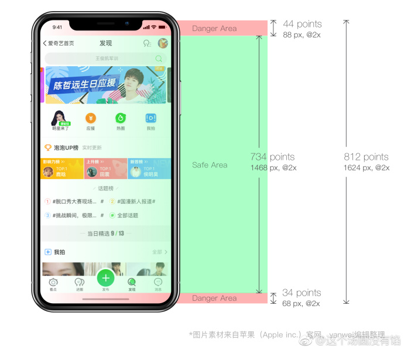
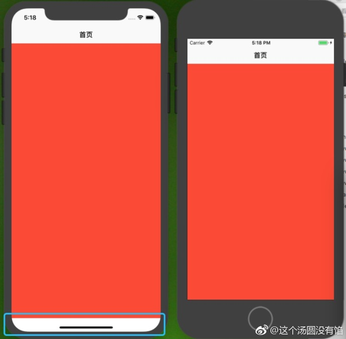
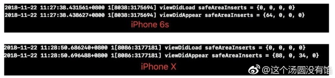
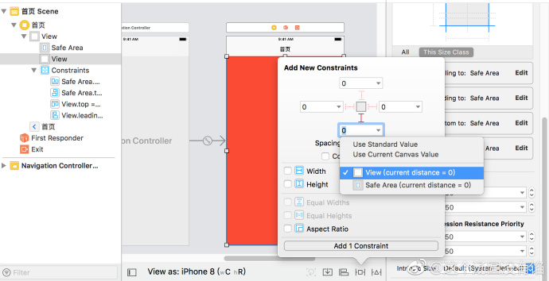

## Safe Area 的一些零散点

**作者：** [这个汤圆没有馅]()https://weibo.com/u/6603469503?refer_flag=1005055010_

先看图一尺寸图。

我们都知道，`iOS 11` 引入了 `Safe Area` 这个概念。在 `xib` 或者 `storyboard` 上添加 `subview`，都是会添加在 `Safe Area` 上的。例如：在 vc 上添加一个 view，上下左右约束分别为 `0`，在 iPhone X 和 iPhone 6 上展示不一样，如下图。纯代码创建的时候不会出现这个问题，因为 subview 是直接添加在 `self.view` 上面。

很明显，在 iPhone X 上底下会有一个 `34pt` 高度的留白区。分别打印一下两个机型的 `self.view.safeAreaInsets`，如下图。

那么假使现在，我希望在 iPhone X 机型上，底下不要留白。页面展示效果跟 iPhone 6 一样。然而 `safeAreaInsets` 是只读属性，无法通过修改值达到目的。

第一种方法，**Align Bottom to**：`Safe Area` 的值改为-34。但是如果后期出了新的机型，那么这个值就不再适配，因为不推荐。

第二种方法，在 `bottom` 的约束上，直接以 `superView` 为参照，如下图。

另外补充几点：

* `- additionalSafeAreaInsets:controller` 可以扩展安全区域，如果我们设置 `self.additionalSafeAreaInsets = UIEdgeInsetsMake(20, 0, 0, 20);` 意思就是在原有的 safeAreaInsets 值中增加对应的边距值。如果原来的是 {10, 0, 0, 10} , 则最后得出的边距是 {30, 0, 0, 30}。
* `- (void)viewSafeAreaInsetsDidChange:` 当视图的安全区域发生变更时会触发该方法，可以通过该方法来处理安全区域变更时的UI布局。
* `- insetsLayoutMarginsFromSafeArea:` 默认值是YES，如果设置为 NO，所有的视图布局将会忽略  `safeAreaInsets` 这个属性了。这个只对纯代码布局视图有效，如果是 `xib` 或者 `storyboard` 布局的话不起作用。一般用于 `tableView` 居多。

