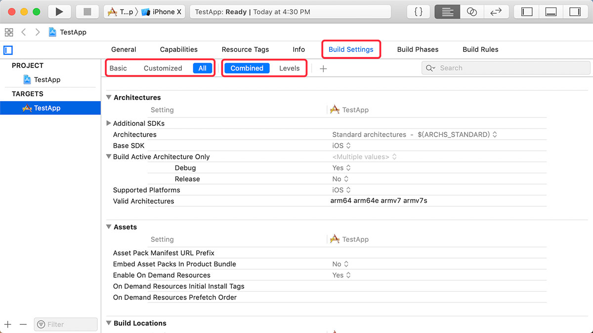
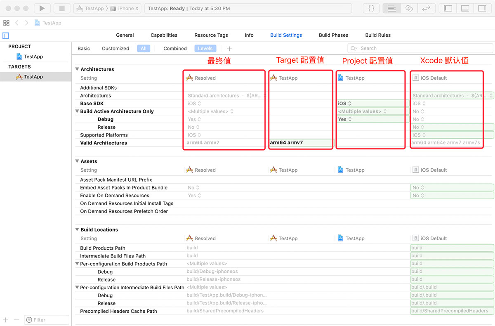

## Xcode 的 Build Settings 选中 Levels 时不同列的含义

**作者**: [KANGZUBIN](https://weibo.com/kangzubin)

Build Settings 顾名思议，用于表示 Xcode 工程的编译配置项。我们在 Xcode 工程中，打开一个 Project 或者 Target 的 Build Settings 时，会得到如下图所示，此时在顶部分栏中一般默认选中 `All` 和 `Combined`。

其中，图中左侧红框内的 `Basic`，`Customized`，`All` 分别表示 `基础配置项`，`已经自定义修改过的配置项` 和 `全部配置项`。

而图中右侧的红框内，有 `Combined` 和 `Levels` 两项，我们最熟悉的是在 `Combined` 模式下，直接修改下方各配置项的值。

当我们选中 `Levels` 模式时，会得到如下图所示：

我们发现，此时每一个配置项都对应了 4 列值（左侧选中 Project 时只有 3 列；选中 Target 时有 4 列），分别为 `Resolved`，`TargetName`，`ProjectName`，`iOS Default`。它们的含义如下：

* `iOS Default` 列：Xcode 工程各编译配置项的默认值，**无法修改**；

* `ProjectName` 列：用于配置 Project 的编译配置项，它会影响其下的所有 Targets 的 Build Settings，优先级高于`iOS Default` 列，**可以手动修改**；

* `TargetName` 列：用于配置某一 Target 的编译配置项，优先级高于 `ProjectName` 列，**可以手动修改**；

* `Resolved` 列：根据前面 3 列的优先级关系，得到最终的值。**它不可手动修改**，优先取 `TargetName` 列的值，如果该列没设置，则取 `ProjectName` 列的值，最后才取 `iOS Default` 列的默认值（`Resolved` 列的各项最终取的那一列的值，会被浅绿色框选高亮显示）。

通过对比这几列数据，你可以很清晰地看出我们都改了哪些默认配置，都是在哪改动的。其实我们可以发现，`Resolved` 列各项的值，就是选中 `Combined` 模式下，各配置项的值。

> PS：在 Pods 工程中各 `Targets` 的 `Build Settings` 可

