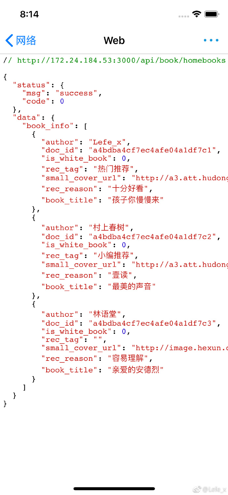
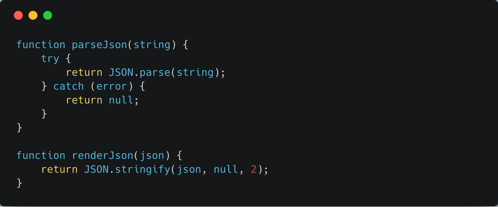
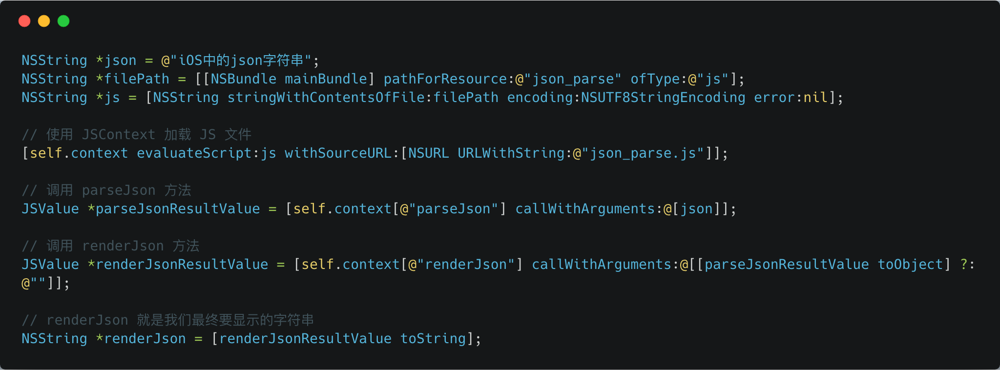

## JSON 格式化显示

**作者**: [Lefe_x](https://weibo.com/u/5953150140)

有时候我们想查看网络请求的内容，我们往往看到的结果是（格式非常混乱）：

```json
{"status":{"msg":"success","code":0},"data":{"book_info":[{"doc_id":"a4bdba4cf7ec4afe04a1df7c1","author":"Lefe_x","is_white_book":0,"rec_tag":"热门推荐","small_cover_url":"http:\/\/a3.att.hudong.com\/42\/58\/01300000820274128088583100471.jpg","rec_reason":"十分好看","book_title":"孩子你慢慢来"},{"doc_id":"a4bdba4cf7ec4afe04a1df7c3","author":"林语堂","is_white_book":0,"rec_tag":"","small_cover_url":"http:\/\/image.hexun.com\/book\/upload\/2013\/03\/07\/153148_20_c.jpg","rec_reason":"容易理解","book_title":"亲爱的安德烈"}]}}
```

上面这中方式，看起来非常不友好。如果能够显示成下图的格式，是不是很爽？我们来看看具体的实现。



想实现上面的效果，可以使用 JS 中的 `JSON.parse` 和 `JSON.stringify` 方法对 json 字符串转换，把转换后的结果使用 UITextView 或者 UILabel 显示出来即可。使用 UITextView 的好处是，内容太长直接可以滚动。图中的实现方式是使用的 `WKWebView`，目的是给 `Json 高亮`（高亮代码可以参考 highlight.min.js）。

iOS 中调用 JS 中的方法我们在知识小集的`《一本走心的JS-NA 交互电子书》`上有很详细的讲解，还不会 `JS-NA` 交互的朋友可以在知识小集公众号输入 jn 即可免费获得。

把用到的 JS 方法定义到一个 JS 文件中，命名为 `json_parse.js`：



iOS 端的代码如下：



有时候在 iOS 中实现不了的需求，可以想着用 JS 来实现，我觉得这是 iOS 与 JS 交互的奥妙之处。

