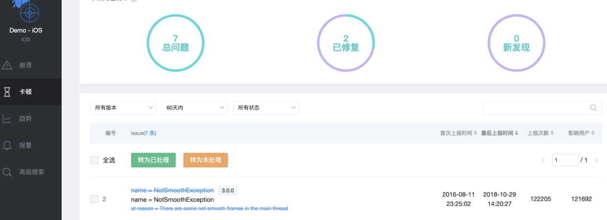
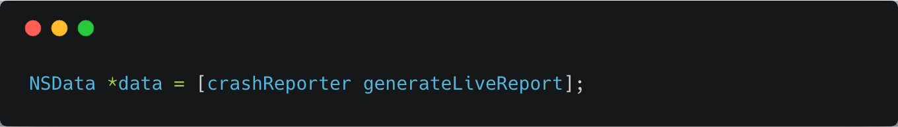
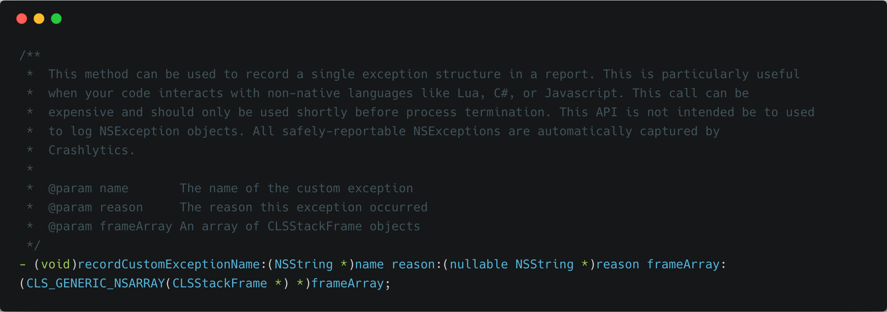
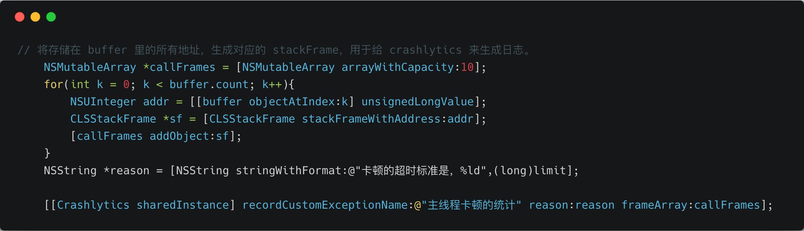
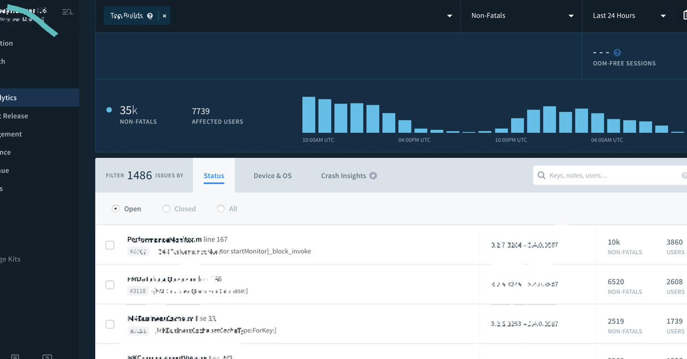

## 为 Fabric MOD 一个卡顿检测功能

**作者**:[@hite和落雁](https://weibo.com/xiangheka)

卡顿检测系统，用于检测 App 的主线程运行情况。在追求 N 个 9 奔溃之外，卡顿也是我们极其重要运行指标。

很遗憾，世界上最好的免费 APM 平台 `Fabric` 却没有。而国内的 bugly、网易云捕等，都提供了类似的功能。如下图是云捕的卡顿功能。

说起来卡顿检测，技术原理很简单，下面是来自 `bugly` 的 QA 里的描述

> iOS 卡顿检查的依据是监控主线程 `Runloop` 的执行，观察执行耗时是否超过预定阀值(默认阀值为3000ms) 在监控到卡顿时会立即记录线程堆栈到本地，在App从后台切换到前台时，执行上报。

卡顿检测系统，这个大任务，可以分解为两部分：卡顿的检测 + 卡顿的展示和管理。

### 卡顿的收集

卡顿的收集，有现成的代码，核心代码可查看 [gist](https://gist.github.com/hite/1a7ee47fd971acad3e9e99b41c41c82e)。

检测到之后，需要获取当前时刻的堆栈，所有线程的堆栈（其实只需要主线程就够了）。

OK，拿来主义，一个很有名 `PLCrashReporter`。我自己集成测试，在我的老古董机器，`iPhone 6` 跑，卡顿是能检测到，但是整个软件基本不可用，整个界面全卡住了。`PLCrashReporter` 生成日志代码如下图所示。

性能非常差，完全不可用。

拿不到堆栈信息，无法展示，所以只能采用造轮子的方式。根据戴铭 blog 里的例子，我改造了下，如 [gist](https://gist.github.com/hite/1a7ee47fd971acad3e9e99b41c41c82e) 所示。我们收集到了所有堆栈的栈顶地址；接下来我们需要将这些栈信息符号化。

很容易想到的方案是传到自己的服务器上，用 Mac 环境处理堆栈的符号化，转换为可读的堆栈数据——代价太大，而且还不经济。

在浏览了 `fabric` 的各项 API 后，我发现有一个很讨好的接口，`recordCustomExceptionName`

### 符号化堆栈，卡顿管理

fabric 提供了 `recordCustomExceptionName` 接口，接口签名如下图所示。

我们利用这个接口，将第一步收集的堆栈数据传给 fabric，让 fabric 给我们符号化，而且 fabric 卡顿日志还能够聚合、分类、分组、跟踪。`crash` 日志的那一套都可以用上， fabric 用户对此是熟悉的。核心代码如下图所示。

至此，我们用很少的代价就做好了一个卡顿检测的系统，并且和奔溃功能一起使用，集中处理 APM 各项指标。

这个方案在月活几十万的 App 应用了快半年了。用户一点都没有感受到有卡顿系统，对现有系统影响很小。如下图所示。

所有的数据都在 `crashlytics` 里，选择 `non-fatal`，即可，从统计下来的数据来看，卡顿主要体验在；

1. 读写文件
2. 读写数据库
3. 处理图片
4. 动画渲染
5. 在非主线程读一些主线程才能用的属性（奇怪吧？）

基本上和我们猜想是一致的，接下来就需要跟踪和处理这些卡顿。

目前这个系统有两个缺陷：

1. 检查卡顿本身的 `runloop` 也被认为是卡顿
2. 因为 `recordCustomExceptionName` 接口的限制，所有线程的栈都被合并到一个栈，但不影响核心卡顿代码的阅读。

