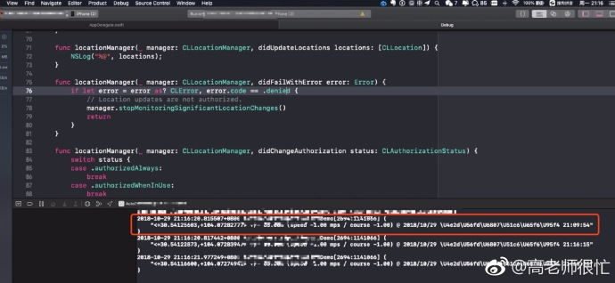
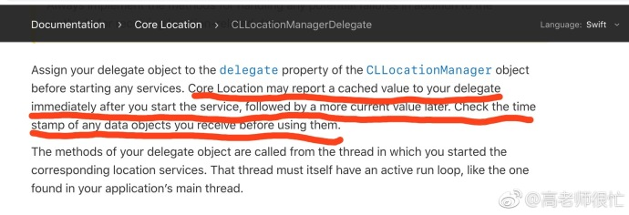

## 关于定位的一个小知识点

**作者**: [高老师很忙](https://weibo.com/517082456)

今天分享一个轻松的小知识点~~~

搜索了网上关于 iOS 定位的文章，很多在 `locationManager(_:didUpdateLocations:)` 收到回调就执行了 `stopUpdatingLocation()`，如下图：

然而在一些情况之下，这样写是有隐患的（如下图），

在某次运行的时候（并不是每次出现），在 21 点 16 分返回了一个 21 点 09 分的点，这是因为 `CoreLocation` 可能会返回一个缓存的值给我们，所以我们使用的时候应该判断一下时间戳（如下图），这样可以减少定位偏差。

