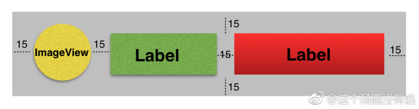
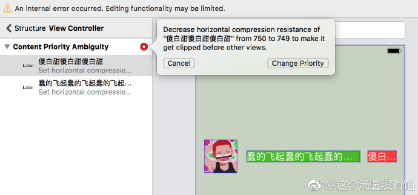
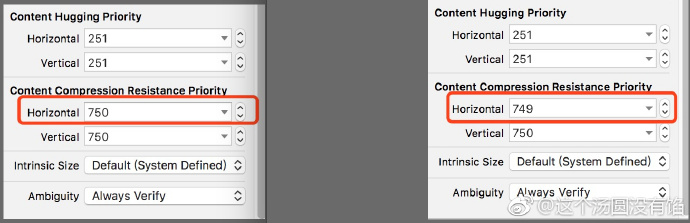
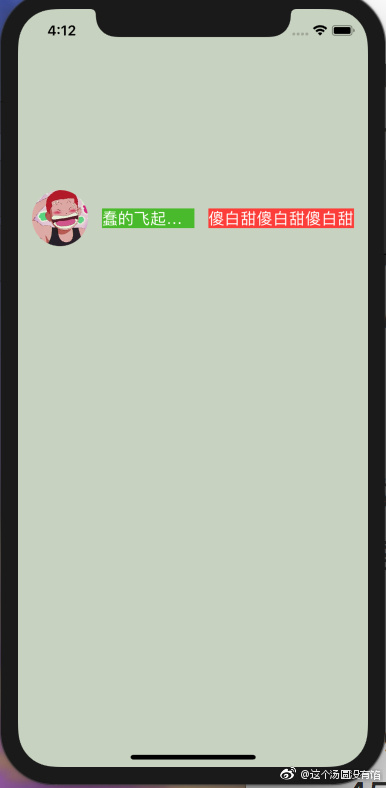

## Storyboard 中的约束优先级

**作者：**这个汤圆没有馅

在 Masonary 中也可以设置约束的优先级，如`make.left.equalTo(weakSelf.view.mas_left).offset(20).priority(250)` 中的 `priority`。

在 `Storyboard` 中也可以，举个🌰：父视图上有 `imgView` 和两个 `label`，现要求两个 label 的宽度随内容且不超出，另必须保证红色 `label` 中的内容显示完整。如下图。

`storyboard` 拖控件就不说了，直接从约束开始。

* imgView： left、right、top、height、width
* 绿色label：left、center-y、right、height
* 红色label：left、center-y、right、height

这个时候 `storyboard` 会报错，因为两个 `label` 的宽度无法定位。如下图。

提示说，降低红色 label 的水平方向压缩阻力(即容易被压缩)以确保在其他视图之前可以被裁剪。点击 `Change Priority`，改变约束优先级。

如上图，我们可以看 `Size Inspector` 中，红色 `label` 水平方向压缩阻力由 `750` 降为了 `749`，说明在水平方向上，绿色 `label` 展示的优先级要高于红色 `label`。当然这和我们一开始的需求反了，待会儿再改。我们先看看 `Size Inspector` 中的说明。

* **Content Hugging Priority**：拉伸阻力，即抗拉伸。值越大，越不容易被拉伸。
* **Content Compression Resistance Priority**：压缩阻力，即抗压缩。值越大，越不容易被压缩。
* **Intrinsic Size**：控件未设置宽高约束时用的。
* **Ambiguity**：解决冲突时是否需要验证。

`Priority` 的值默认分为三个等级 `Required(1000)`、`High(750)`、`Low(250)`，其实可以输入任意其他数字。

好，回到需求，只要把红色 `label` 的水平方向压缩阻力优先级的值改成任意大于绿色 `label` 压缩阻力的值即可。如果红色 `label` 的内容太多，那就会把绿色 `label` 给挤没掉。如下图。

