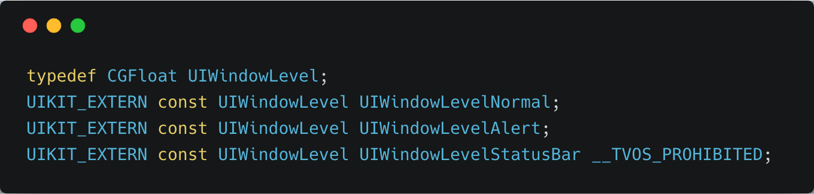

## UIWindow 的显示特性与常见操作方法小结

作者：陈满iOS

### UIWindow 的显示特性

1、相同 `windowLevel` 下，调整 UIWindow 显示层的基本方法

1) 显示相关属性：hidden 

- 如果仅仅想显示一个UIWindow

```objc
customWindow.hidden = NO;
```

> 虽然设置自己的 hidden 即可显示出来，但上述方法并不会"自动"影响之前显示的 UIWindow 对象的 hidden 属性。如果，之前 UIWindow 的 `hidden = NO`，设置新 UIWindow 的 hidden 将旧 UIWindow 覆盖后，旧 UIWindow 的 hidden 属性依旧为 NO。

- 如果仅仅想隐藏一个 UIWindow

```objc
customWindow.hidden = YES;
```

> 如果你没有专门设置过 hidden 属性，系统默认为 YES。上述代码会将 UIWindow 绝对隐藏，不管有没其他 UIWindow 覆盖。当也没有其它非隐藏的 UIWindow 的时候，APP 屏幕完全黑屏。

- 如果想显示一个UIWindow，同时设置为keyWindow，并将其显示在同一windowLevel的其它任何UIWindow之上

```objc
- (void)makeKeyAndVisible
```

> 上述方法真的会将其显示在同一windowLevel的其它任何UIWindow之上！显示最上层的UIWindow以最后执行过该代码的UIWindow为准。

2) 显示相关方法：makeKeyAndVisible 的作用

```objc
[self.window makeKeyAndVisible];
```

其执行效果包括 但不限于 执行了如下代码（因为还会覆盖同 level 的所有 window）：

```objc
[self.window makeKeyWindow];
self.window.hidden = NO;
```

讲真，`makeKeyAndVisible` 真的会自动改变 hidden 属性值为 NO。

3) UIWindow 对象的 hidden 属性默认值

- 默认值：true

> 如果你仅仅创建一个 UIWindow，而又不专门设置 hidden 属性（或者makeKeyAndVisible），系统默认分配的默认值为true。

4) 误区：关于 `keyWindow` 的混淆易错点

设置 keyWindow 与否并不影响视图层级显示，仅来接收键盘及其它非触摸事件。如果没有专门设置过 keyWindow 的 hiden 为 NO，而且也没有其它非隐藏的 UIWindow，那么APP会黑屏。

- 如果仅仅设置为keyWindow

```objc
- (void)makeKeyWindow
```

- 如果仅仅解除为keyWindow

```objc
- (void)resignKeyWindow
```

app 的 keyWindow 与是否在最上层显示没有任何关系。比如，你如果想通过 `[[UIApplication sharedApplication] keyWindow]` 获取正在显示的 UIWindow 是极其不准确 的。有时候通过这个代码获取的如果真的是正在显示的 UIWindow，仅仅是因为碰巧而已。

5) 警惕点：有多个 `hidden` 属性 `=NO` 的 `UIWindow`，该显示谁？

如上所见，`makeKeyAndVisible` 与 hidden 的 setter 方法均可以改变 hidden 的值，但有个问题，经过多次调整，可能有多个 UIWindow 的 hidden 都为 NO，那么应该显示谁？

- 对于 hidden 的 setter 方法，最终显示的以最后执行过 `.hidden=NO` 的 UIWindow 为准，且执行 .hidden=NO 之前 hidden 的值为 YES。（hidden如果是从NO改为NO的不 算 最后 改变UIWindow的显示状态）
- 对于 makeKeyAndVisible 方法，最终显示的以最后 执行过 makeKeyAndVisible 的 UIWindow 为准。
- 对于先后分别用 makeKeyAndVisible 方法和 hidden 的 setter 方法，还是先后分别用 hidden 的 setter 方法和 makeKeyAndVisible 方法，结局同样以最后改变显示状态的 UIWindow 为准。

2、基于 `windowLevel`，调整 UIWindow 显示层的拓展方法

先去 UIWindow.h 里面看看 UIWindowLevel 的定义：



例如，在手势相关类中调整自定义的 UIWindow 层级

```objc
[self.window makeKeyAndVisible]; 
_window.windowLevel = UIWindowLevelAlert;
```

- 打印代表 UIWindowLevelAlert 层级的数据值

```
(lldb) po self.window.windowLevel
2000
```

- 同理，打印代表UIWindowLevelStatusBar层级的数据值

```
(lldb) po self.window.windowLevel
1000
```

- 同理，打印代表UIWindowLevelNormal层级的数据值

```
(lldb) po self.window.windowLevel
0
```

小结：

1. windowLevel 数值越大的显示在窗口栈的越上面
2. 显示层的优先级 为： UIWindowLevelAlert > UIWindowLevelStatusBar > UIWindowLevelNormal
3. 系统给 UIWindow 默认的 windowLevel 为UIWindowLevelNormal

### UIWindow常见操作方法总结

1、获取 App 所有 window 的 windows 数组

```objc
[[UIApplication sharedApplication] windows]
```

例如，第三方加载动画框架 KVNProcess 中 KVNProgress.m 文件会有一段这样的代码，如下图1所示

2、keyWindow

```objc
[[UIApplication sharedApplication] keyWindow]
```

例如，第三方下拉菜单框架 FFDropDownMenu 的 FFDropDownMenuView.m 文件中有这样一段代码：

```objc
UIWindow *keyWindow = [UIApplication sharedApplication].keyWindow;
[keyWindow addSubview:self];
```

这段代码的目的是添加到最上层 UIWindow，但实际操作是把自己的视图添加到 keyWindow 上。其实，如果我们在编写代码时严谨地保证 keyWindow 是显示在最上层的 UIWindow，这样写没有问题。但如果：自己或者其它第三方框架曾经调高过其它 UIWindow 属性 windowLevel，或者有同级 windowLevel 的其它 UIWindow 后来改变过显示状态（如 .hidden=NO，makeKeyAndVisible 等），可能会导致下拉菜单的弹出视图无法显示（被覆盖）。

3、获取 AppDelegate 单例的 window 属性
专门获取 AppDelegate.m 文件中的 window 属性，不包含其它其定义的 window

```objc
[[[UIApplication sharedApplication] delegate] window]
```

