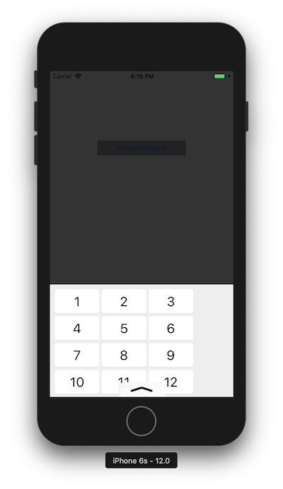
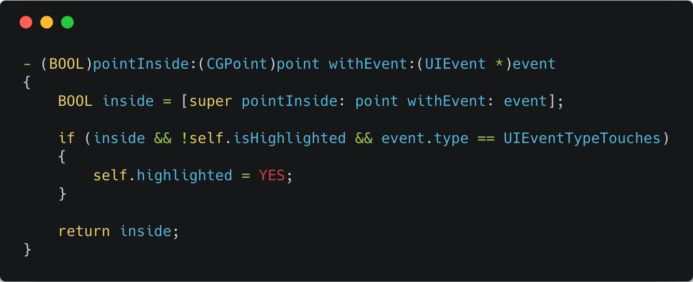

## 屏幕底部边缘系统手势与按钮点击冲突

**作者**: [南峰子](https://weibo.com/3321824014)

最近同事遇到一个问题，将按钮放在屏幕底部边缘时，有一部分区域（下半部分）点击时，无高亮效果。其原因是默认情况下，屏幕边缘会先尝试响应系统手势（底部是上拉操作，如下图中的箭头），在确定不是响应系统手势后，会继续响应 `ViewController` 上的手势。所以，如果在按钮上稍微停留一会，就会看到点击的高亮效果。

当然这不是我们想要的。

在 iOS 11 后，UIViewController 新添加了一个 `preferredScreenEdgesDeferringSystemGestures` 方法，我们可以在 `ViewController` 中重写这个方法，返回一个 UIRectEdge，以确定哪个位置优先处理 `ViewController` 的手势，再延后执行系统的手势。这个方法需要配合 `setNeedsUpdateOfScreenEdgesDeferringSystemGestures` 方法一起使用。

不过，在上面这个情景中，似乎没有起作用，按钮依然没有及时高亮。所以在 `stackoverflow` 上搜索一下，看到了一个解决方案：继承 UIButton，并重写 `- (BOOL)pointInside:(CGPoint)point withEvent:(UIEvent *)event;` 方法。如下代码所示。由于该方法在 `hitTest` 时就会调用，所以点击下去时，在这个方法里面设置 `self.highlighted = YES;` 即可，这样同时也能兼容之前的系统。

