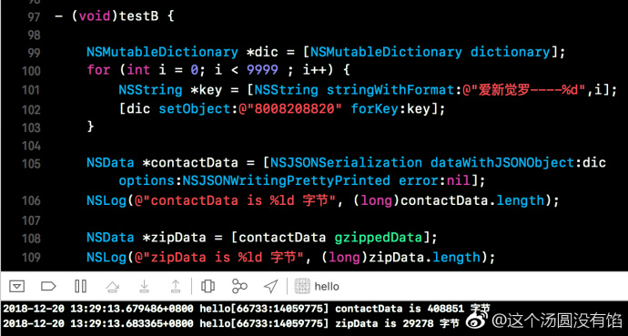
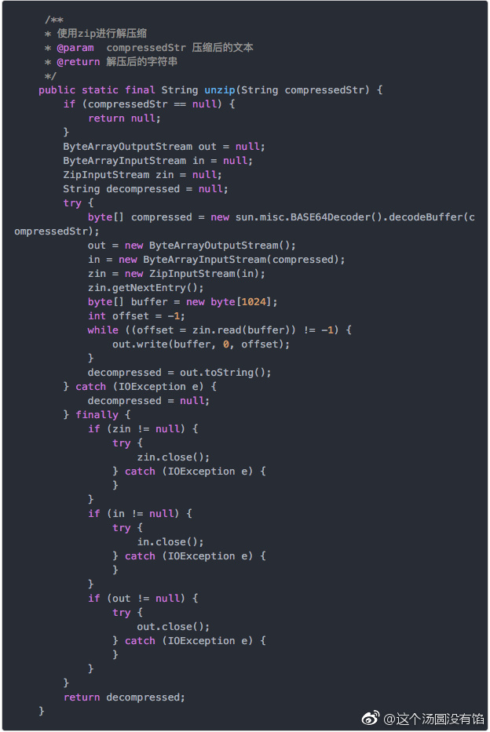

## iOS 中的 GZIP 压缩

作者：[这个汤圆没有馅](https://weibo.com/u/6603469503?refer_flag=1005055010_)

当项目中与后端接口交互涉及到大量数据信息的时候，为了提升响应速度需要对传输的数据进行压缩，压缩成功后将 `data` 转化为 `string` 传给服务器。

关于 iOS 端的 `GZIP` 压缩，[这里](http://t.cn/RUBP1Le)是我目前在 github 上找到的 star 数最多的一个。

GZIP 支持 `Cocoapods`，如果手动导入的话，记得在 `Targets--Build Phases--Link Binary With Libraries` 中添加 `libz.1.2.5.tbd`。

模拟一万条简单的数据，看看压缩前后数据大小变化。如下图：



经过 GZIP 压缩后，字节量缩小幅度很大。但是压缩后的 data 是无法通过 `- (nullable instancetype)initWithData:(NSData *)data encoding:(NSStringEncoding)encoding;` 这个方法得到string的。

这个时候我们再来看 java 中对于压缩的数据是如何解压缩的，java 代码如下图。



其中有一行代码为

```java
byte[] compressed = new sun.misc.BASE64Decoder().decodeBuffer(compressedStr);
```

说明 java 是对 `base64` 的 string 进行解压缩的，也就是说我们在进行 data 压缩后，需要传 base64 的 string 给服务器。那么只需要加一行代码：

```objc
[zipData base64EncodedStringWithOptions:0];
```

