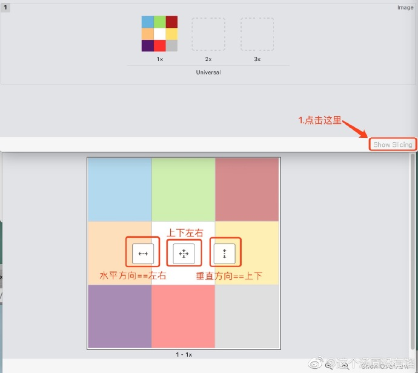
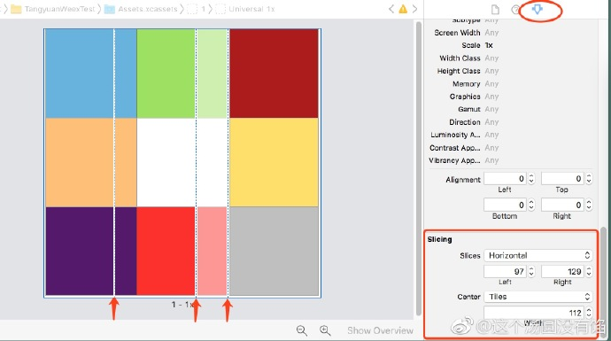
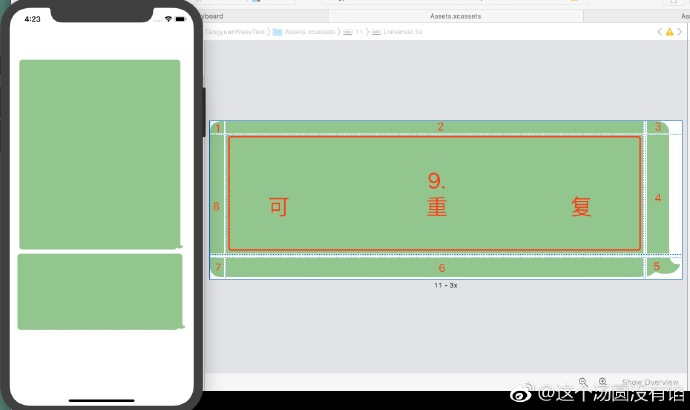

## 关于 Assets 中图片的 Slicing 功能

`Image Slicing` 功能是在 WWDC 2013 中 `Xcode 5` 中新增的，类似于安卓里面的 `Create 9-Patch file`。现在用的最多的场景就是聊天功能中，聊天内容的背景框图片可以随文字高度自动拉伸。

接下来，我们用一张颜色鲜明的图来看看 `Slicing` 到底是如何作用的。进入 `Assets`，选中图片，点击右下角的 `Show Slicing`，在图片上出现三个可操作按钮。如下图。

先看水平方向。点击之后如下图，图片上出现三根线，`Inspector` 面板中也有 `Slicing` 对应的设置。

如下图👇

* 左边线表示左边的区域不能被重复
* 右边线表示右边的区域不能被重复
* 中间线和左边线之间的区域被重复
* 中间线和右边线之间的区域舍弃掉(舍弃的部分会有白色蒙板)

同理，从垂直方向上看也一样。左边和右边分别对应上边和下边。如果同时有水平和垂直方向，那么重复区域取交集，不能被重复部分选并集，舍弃掉的部分视觉上可直接看到。

* slices：拉伸的方向，其中有四个选项。不同选项下方对应的 insert 也不一样。
* center：重复部分的填充方式
	- Tiles：平铺
	- Stretches：拉伸

`center` 下的 `width` 和 `height` 分别代表可重复部分的宽和高，只有上下左右同时裁剪的时候才会有。在只有水平方向时，只有 `width`；在只有垂直方向时，只有 `height`。（ps：直接配置上述各种数值和手动拖线的功能是一样的。）

接下来直接拿一张聊天背景框的图片操刀练手一下。背景框图片带四个圆角，首先这四个圆角是不能被重复的，由于是纯色背景图，那么可重复和被舍弃部分就有好几种方案。如图四，提供其中一种 `slicing` 方案，1~8 都是不可重复的。模拟器上跑起来，不管 `imageView` 的高度如何，图片都不会变形或模糊。

最后，建议各位动手实践一下会了解的更透彻🤗

