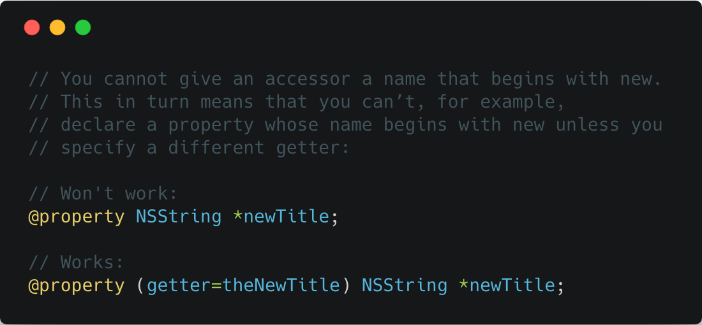
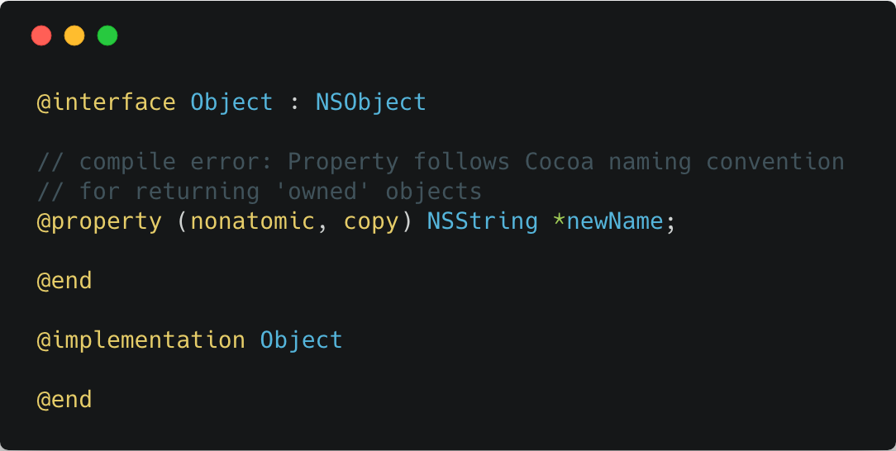
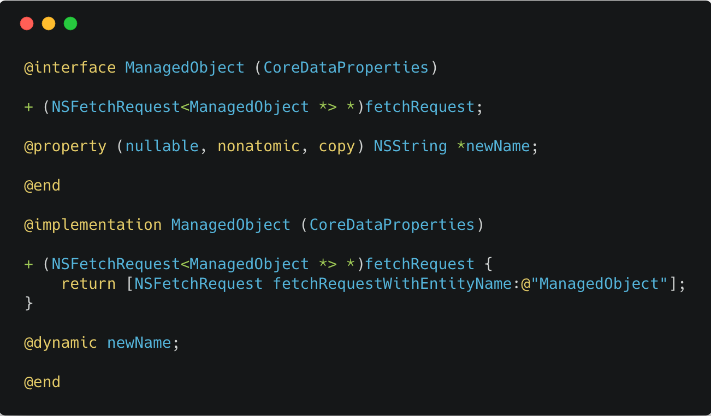

## 一个命名引发的崩溃

**作者**: [Vong_HUST](https://weibo.com/VongLo)

作为开发工程师，相信大家最头疼的有时候不是需求的实现，而是一个优雅的命名，恰当的命名让人阅读起来非常顺畅。

前段时间因为命名的问题引发了一个崩溃。事情是这样的，服务端某个字段有了新的含义，为了不影响老版本，索性在原来的字段上加了个前缀。比如之前是 `name`，修改之后改成了 `new_name`，然后 `mapping` 的时候，本地 `Model` 直接将服务端蛇形命名规则替换为驼峰命名规则，即 `newName`，嗯，一切看起来似乎很完美。然后跑起来之后，这个请求完成后，就一顿乱崩，然后比对代码也没发现什么大问题。后面发现这个属性的名字有个 `new`，之前有一点印象是说 `ARC` 之后命名中不能带 `new`，后来查阅苹果文档，才发现确实有说到这一点，如下所示，意思就是属性名不能以 `new` 开头，除非提供自定义的 `getter` 方法（前提是 `getter` 也不能以 `new` 开头）。

这个时候验证欲强的老哥已经打开 Xcode 来验证了，然后写了一下代码

根本就编译不过，这不是骗人吗？其实没有，因为我的 `Model` 是继承自 `NSManagedObject`，然后根据 `.xcdatamodeld` 文件由系统自动生成的类，相信熟悉 CoreData 的同学都知道这个操作，代码如下（猜测由于 `NSManagedObject` 子类的属性是 `@dynamic` 的，所以 Xcode 不会去检测，如果自己写一个继承 `NSObject` 的类，即使属性是 `@dynamic` 也会报错，可自行测试。如果你知道具体原因，可以分享给大家，一起学习下~）

最后，希望大家都不会被命名所困扰~

#### 参考链接

[Transitioning to ARC Release Notes](https://developer.apple.com/library/archive/releasenotes/ObjectiveC/RN-TransitioningToARC/Introduction/Introduction.html)

