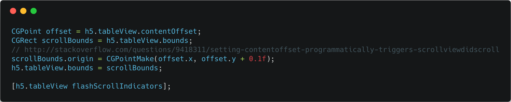

## 解决 WKWebview 滚动后白屏问题

**作者**:[@hite和落雁](https://weibo.com/xiangheka)

有这样一个场景：

整个页面是一个 `scrollView`，宽度为屏幕宽度，`pagingEnabled=YES`，内容宽度为 `2 * 屏幕宽度`，里面有两个子 `controller`，每个子 `controller` 都有一个全屏的 `WKWebview`。 左右滑动 `scrollView` 可以切换两个 `WKWebview` 的显示，每个 `WKWebview` 都有一个很长的页面，可以上下滚动。

按照以下操作：

1. 第一个 `WKWebview`，触发一次滚动，在滚动没有结束的时候，切换到第二个 `WKWebview`；
2. 在第二个 `WKWebview` 里停留，等第一个 `WKWebview`，触发的滚动结束后，切换到第一个 `WKWebview`；
3. 此时，第一个 `WKWebview`，界面空白或者残缺不全，稍微触发下滚动，界面会再次显示；
4. 如果在第一个 `WKWebview` 触发的滚动未结束时，返回到第一个 `WKWebview`，不会出现 bug。

这个 bug 在 iOS 11 + 都有。

经过我的搜索，应该是 webkit 自己的 [bug](https://bugs.webkit.org/show_bug.cgi?id=182868)。目前还没有解决。

临时的解决方案是：在第一个 `WKWebview` 再次可见时触发一次 `scroll`。注意：这次设置 `offset` 不能触发 `scrollViewDidScroll`，否则会死循环。代码如下;

移动一个很小的位移，基本用户不会察觉到的。

