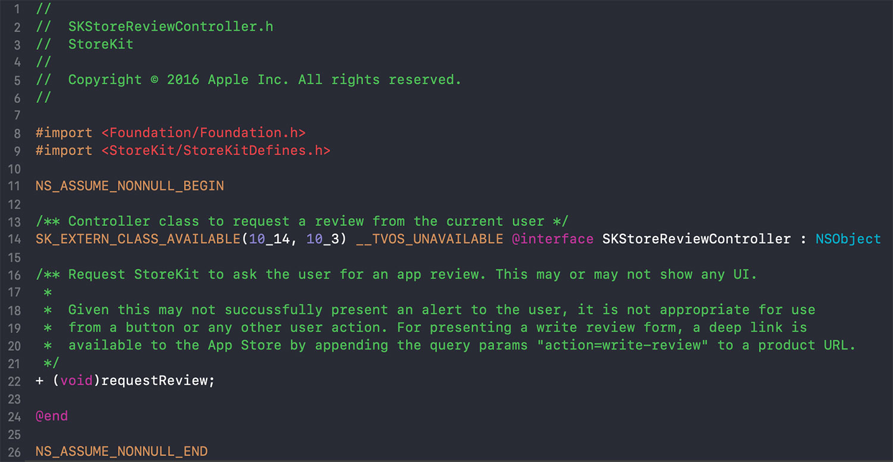
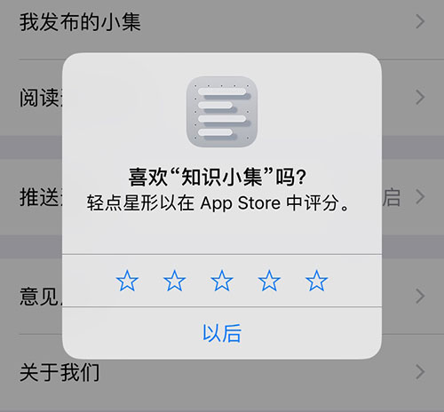

## iOS App “去评分” 功能的几种实现总结

**作者**: [KANGZUBIN](https://weibo.com/kangzubin)

通常 App 都会在它的设置页面或者关于页面添加一个“去评分”选项，或者在用户使用 App 过程中适当时机弹窗，引导用户跳转到 `App Store` 对当前 App 进行评分或者撰写评论。

绝大部分 App 实现这个功能的方式为：调用 `UIApplication` 的 `openURL:` 方法，打开当前的 App 的 `App Store URL`，如下：


备注：上述 URL 中 id 字符串后续的数字为当前 App 对应的 `Apple ID`，可以在 App Store Connect 后台查到；另外 `openURL:` 方法在 iOS 10 以后已被弃用，替换为 `openURL:options:completionHandler:`。

但是，这种方式只是打开 App 的 `App Store` 详情页面，用户如果想进行评分或评论，需要在该页面往下滑，找到“评分及评论”部分，才能“轻点评分”或“撰写评论”。以微信为例，操作流程如下图：


我们如果想让用户跳转到 `App Store` 后，直接弹出“撰写评论”页面，则可以在上述 App 的链接地址后面加上 `action=write-review`，如下：

```text
itms-apps://itunes.apple.com/app/id1406237249?action=write-review
```

也可以写成如下 URL，此时打开的是“评分及评论”页面：

```text
itms-apps://itunes.apple.com/WebObjects/MZStore.woa/wa/viewContentsUserReviews?type=Purple+Software&id=1406237249
```

此外，从 iOS 10.3 开始，Apple 在 `StoreKit` 框架中增加了一个类 `SKStoreReviewController`，它只有一个类方法 `requestReview`，定义如下图，通过弹窗让用户直接在 App 内进行评分，然后撰写评论。



因此，我们可以适当的时候调用上述方法 `[SKStoreReviewController requestReview];` 在应用内弹出评分框，表现如下图：



不过这种方式有限制，是否弹出评分框由系统决定，详见[这篇文章](https://www.jianshu.com/p/cfa3036bf428) 的讨论。

以上，希望对大家有所帮助。

