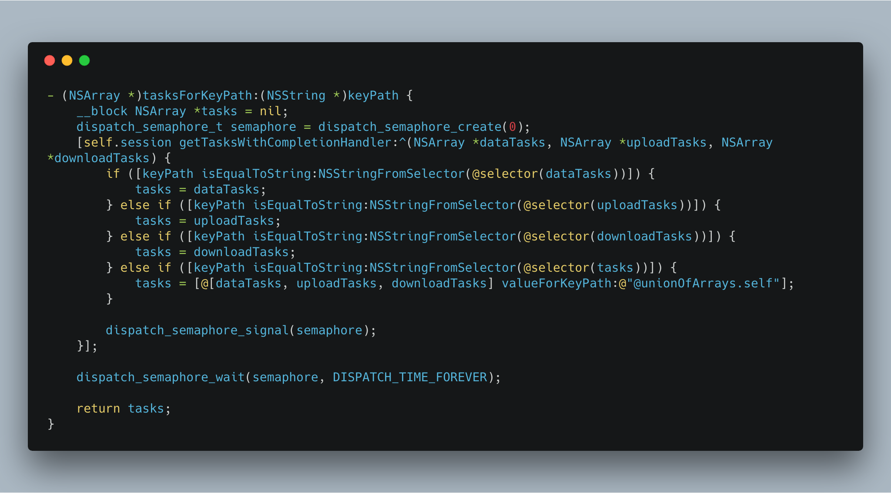

## 利用 GCD 信号量将异步方法改造为同步方法

**作者**: [halohily](https://weibo.com/halohily)

有的时候，我们会遇到一个同步方法（该方法的所有工作在返回之前已全部完成）的内部实现，需要依赖其他异步过程的情况。比如接口定义了一个开启聊天会话的方法，返回值为布尔值。从返回值类型不难推测，我们希望这个方法返回之时，会话是否开启成功就已经确切得知。然而，开启会话的内部实现仅仅是向服务端发起连接请求，是否连接成功需要等待服务端的响应，显然这是一个异步的过程。这就是一个常见的异步过程需要改造为同步（对外表现同步）的场景。如何实现呢？可以采用 GCD 的信号量：发起连接请求之前，创建一个初始值为 0 的信号量，在方法返回之前请求该信号量（P 操作），同时，在连接请求的结果回调中释放该信号量（V 操作）。这样，发起连接请求后，由于信号量初始值为 0，会阻塞在请求信号量的地方，连接请求回调回来之后，释放信号量，刚刚的信号量请求被满足，方法得以返回。这样对外表现即为一个同步且耗时的开启会话操作，虽然这个场景比较别扭，但与此类似的情景是很常见的。

在大家熟知的 AFNetworking 中，就有这样的应用：

