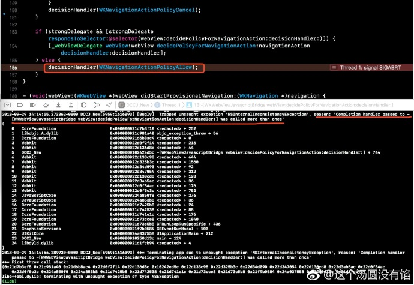
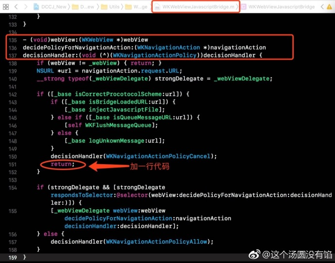
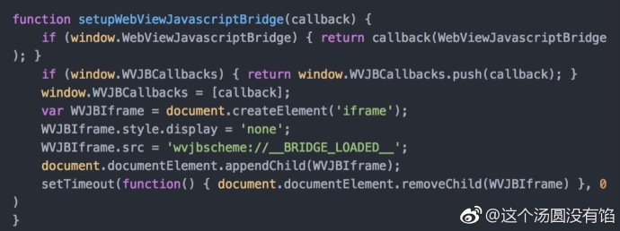

## WKWebView 使用 WKWebViewJavascriptBridge 需要注意的地方

原生端与 H5 端交互，比较常用的就是 `WebViewJavascriptBridge`。建桥过程这边不再赘述，只要下载 Github 上的 Demo 参考即可，OGitHub - marcuswestin/WebViewJavascriptBri...。

> 注意点一：Run 以后会捕捉到一个 Crash，在官网的 Demo 里同样会有这个 Crash，如图一。这个 Crash 只有在用 WKWebView 里会出现，用 UIWebView 是好的。

解决方法：在 `WKWebViewJavascriptBridge.m` 文件line 150 后面加一行代码。如图二。参考 [issue](https://github.com/marcuswestin/WebViewJavascriptBridge/issues/278) 。不知为何，作者没有合并该 issue，源码里也未修复。因此用 `cocoapods` 集成库的同学，每次 `pod install` 后要检查源码中是否有添加上述一行代码。

> 注意点二：注册 bridge 后，与 H5 的交互无法成功。

解决方法：检查一下 H5 小伙伴代码里有没有图三代码段落。这一段 js 代码是不能改的，需原样复制。查看源码发现，在 `WKWebViewJavascriptBridge.m` 文件 line 135 方法中，`[_base injectJavascriptFile]` 是注入 js 文件，也是交互的关键。在执行这行代码之前，有 `[_base isBridgeLoadedURL:url]` 这个判断，点进去查看该判断的实现，发现两个宏 `kCustomProtocolScheme` 和 `kBridgeLoaded` ，分别对应 `@"wvjbscheme"` 和` @"__BRIDGE_LOADED__"` 。 这也就跟图三代码中的 `WVJBIframe.src = 'wvjbscheme://__BRIDGE_LOADED__';` 对上了。

