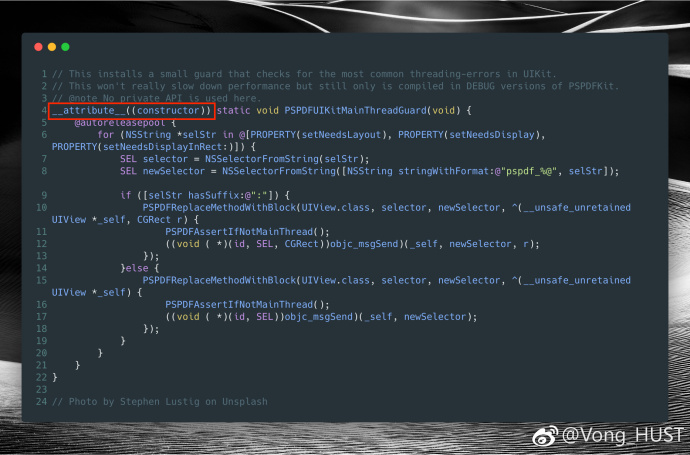
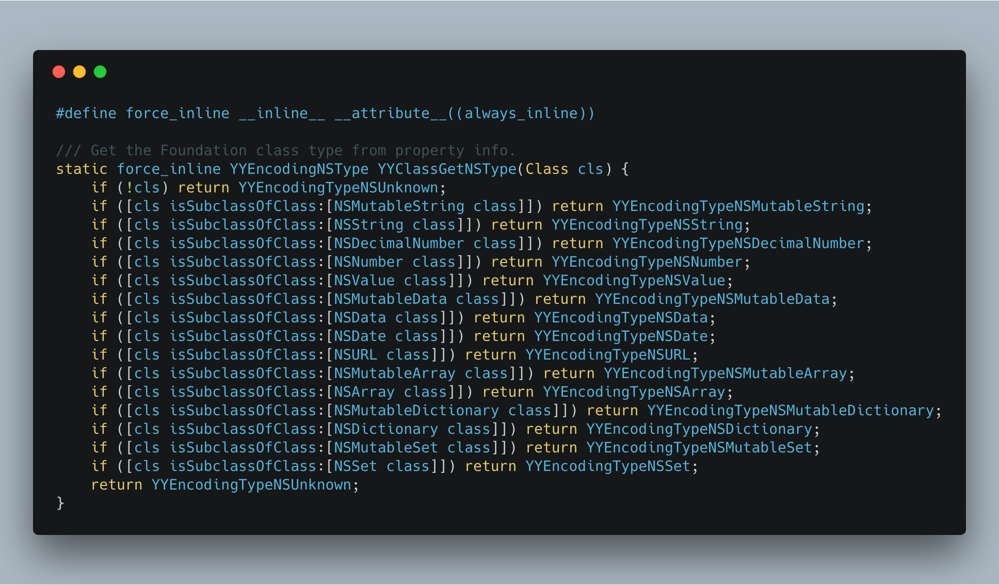
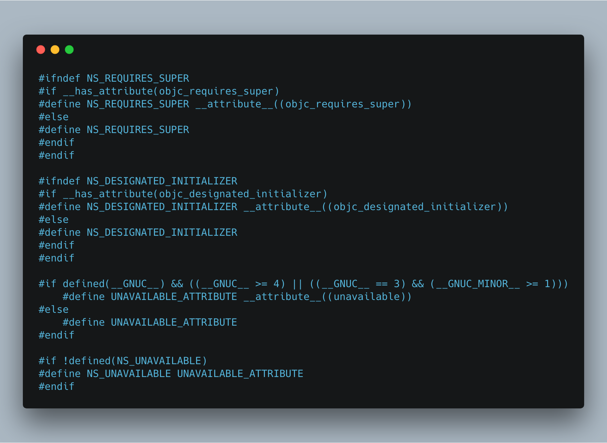

## 开源库使用的 Clang \_\_attributes\_\_

**作者**: [Vong_HUST](https://weibo.com/VongLo)

今天和大家分享一下第三方开源库使用到的一些实用的 `Clang attributes`。

图1出自 `PSPDFUIKitMainThreadGuard`————一个用于检测是否在非主线程调用 UI 相关的工具，使用的是 `__attribute__((constructor))`，被该修饰符修饰的函数（仅对 C 函数生效），会在 main 函数之前执行，但是稍微比 +load 晚一点，因为 `dyld` 调用完 `image` 中所有类的 `load` 方法之后才会调用 `image` 中的 `constructor`。这个修饰符支持优先级的设置，如 `__attribute__((constructor(1024)))`，其中 1~100 为系统保留。

下面代码出自 YYModel，修饰符 `__inline__ __attribute__((always_inline))` 意味着强制内联，什么意思呢？就是它看起来是一个函数，但是编译的时候，会被编译器优化，相当于把函数体内代码直接插入到被调用的地方，这样就避免掉了一些压栈、返回等操作，加快调用。

当然系统也有很多宏是对 `Clang attributes` 的封装，一些系统封装宏代码如下，更多例子可以自行查看系统头文件。

参考链接：

* http://blog.sunnyxx.com/2016/05/14/clang-attributes/
* https://vongloo.me/2017/04/21/Modern-Objective-C/
* https://gcc.gnu.org/onlinedocs/gcc/Inline.html
* https://blog.twitter.com/engineering/en_us/a/2014/attribute-directives-in-objective-c.html
* https://nshipster.com/__attribute__/

