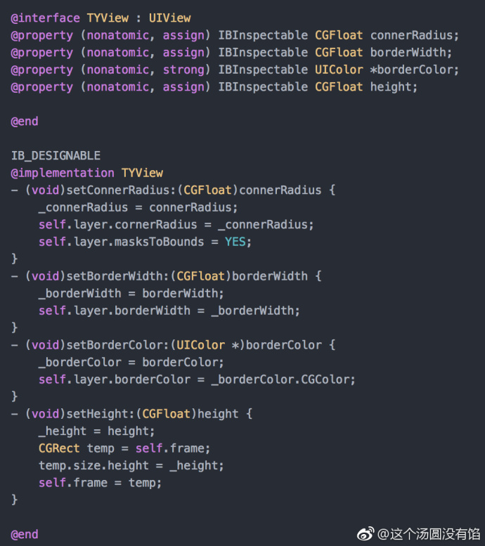

## IBDesignable + IBInspectable 实时更新 UI

**作者：**这个汤圆没有馅

前缀 IB，平时见到最多的就是可视化编程中的 `IBAction` 和 `IBOutlet` 。同样，`IBDesignable` 和 `IBInspectable` 也是在可视化编程中使用。

用 `IBInspectable` 声明的属性，可在 `Xcode` 面板里的 `Runtime Attributes` 里直接配置。用 `IBDesignable` 表明的类，则可以直接在 `storyboard/xib` 中看到修改上述属性产生的变化，不需要 `run` 整个 app。

关于用法。

一、创建一个 View，声明属性。一定要写 set 方法，不然不起作用。Swift 版和 OC 版代码分别如图下两图。




二、在 `storyboard` 拖一个 `view` ，`Class` 选为自定义的类，点击面板上 `Runtime Attributes`，会发现类中声明的属性出现在 `xcode` 面板上。直接修改属性值，此时 `storyboard` 上的 `view` 会直接刷新 UI。如下图。


有一点值得注意的是，如果声明的属性本身自带可以用点语法设置的，比如 `backgroundColor`，用 `override` 重写 set 方法，`Runtime Attributes` 确实会出现该属性，但是马上就会出现一个错误，并且 `storyboard` 页面已无法正常显示，如下图。编译的时候是 success 的，然而运行时就会直接 `crash`。


若声明的属性名与自带属性名不同，但是 set 方法与自带属性的 set 方法相同，代码如下。

```objc
@ IBInspectable  var backColor: UIColor?
{
  get { return self.backgroundColor }
  set { self.backgroundColor = newValue }
}
```

此时 `xcode` 面板上会出现两处设置背景颜色地方，最后运行时的 UI 效果优先显示自定义属性值，如下图。


