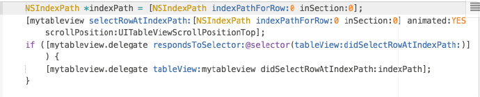

## UITableView & UICollectionView 设置单元格的默认选中状态

作者：陈满iOS

### 1. 场景需求

一个表格视图（或者宫格视图）中，当一个单元格被选中时设置彩色样式，选中其它单元格时设置灰色样式。

### 2. 一个思路

通过实现选中和非选择的代理，以在适当的时机进行UI更新操作。

### 3. UITableView

#### 3.1 通过屏幕点击改变的选中状态回调给代理

```objc
//选中
- (void)tableView:(UITableView *)tableView didSelectRowAtIndexPath:(NSIndexPath *)indexPath;
//非选中
- (void)tableView:(UITableView *)tableView didDeselectRowAtIndexPath:(NSIndexPath *)indexPath;
```

#### 3.2 代码设置默认选中状态 (要等数据加载完成之后再调用)

执行方法的主体：tableview 对象

```objc
//选中
- (void)selectRowAtIndexPath:(nullable NSIndexPath *)indexPath animated:(BOOL)animated scrollPosition:(UITableViewScrollPosition)scrollPosition;
//非选中
- (void)deselectRowAtIndexPath:(NSIndexPath *)indexPath animated:(BOOL)animated;
```

注意的是：

1. 上述代码强制设置某单元格选中或者不选中那一刻，都不会回调 tableview 的选中代理方法，也不会发出通知 `UITableViewSelectionDidChangeNotification`。
2. 之后，通过屏幕点击选中其它 cell 的时候，可以执行 `- (void)tableView:(UITableView *)tableView didDeselectRowAtIndexPath:(NSIndexPath *)indexPath;` 代理方法，你就有机会还原 cell 的默认样式。

#### 3.3 补充：代码设置默认选中状态

执行方法的主体：cell 对象

```objc
- (void)setSelected:(BOOL)selected animated:(BOOL)animated;                     // animate between regular and selected state
```

注意的是：

1. 这种方法改变 cell 的选中状态时，当通过屏幕点击选中其它 cell 的时候，UITableView 并不会执行 `- (void)tableView:(UITableView *)tableView didDeselectRowAtIndexPath:(NSIndexPath *)indexPath;` 的非选中代理方法，你也就没有机会还原 cell 的默认样式。

### 4. UICollectionView

#### 4.1 通过屏幕点击改变的选中状态回调给代理

```objc
//选中
- (void)collectionView:(UICollectionView *)collectionView didSelectItemAtIndexPath:(NSIndexPath *)indexPath;
//非选中
- (void)collectionView:(UICollectionView *)collectionView didDeselectItemAtIndexPath:(NSIndexPath *)indexPath;
```

#### 4.2 代码设置默认选中状态 (要等数据加载完成之后再调用)

执行方法的主体：UICollectionView 对象

```objc
//选中
- (void)selectItemAtIndexPath:(nullable NSIndexPath *)indexPath animated:(BOOL)animated scrollPosition:(UICollectionViewScrollPosition)scrollPosition;
//非选中
- (void)deselectItemAtIndexPath:(NSIndexPath *)indexPath animated:(BOOL)animated;
```

注意的是：

1. 类似的，上述代码强制设置某单元格选中或者不选中那一刻，都不会回调选中代理方法，也不会发出通知。
2. 之后，通过屏幕点击选中其它 cell 的时候，可以执行 `- (void)collectionView:(UICollectionView *)collectionView didDeselectItemAtIndexPath:(NSIndexPath *)indexPath;` 代理方法，你就有机会还原 cell 的默认样式。

#### 4.3 补充：代码设置选中状态

执行方法的主体：cell对象

```objc
- (void)setSelected:(BOOL)selected;
```

注意的是：

1. 类似的，这种方法改变 cell 的选中状态时，当屏幕选中其它 cell 的时候，UITableView 并不会执行 `- (void)collectionView:(UICollectionView *)collectionView didDeselectItemAtIndexPath:(NSIndexPath *)indexPath ;` 代理方法。

### 5. 比较

比如，下面两种方案:

```objc
    NSIndexPath *indexPath = [NSIndexPath indexPathForRow:0 inSection:0];
    UICollectionViewCell *cell = [self.collectionView cellForItemAtIndexPath:indexPath];
    [cell setSelected:YES];
```

上述方案仅仅改变 cell 的属性，但当屏幕点击选中其它 cell 的时候，也不会执行原 cell 的非选中代理。

```objc
    [self.collectionView selectItemAtIndexPath:[NSIndexPath indexPathForItem:0 inSection:0] animated:YES scrollPosition:UICollectionViewScrollPositionNone];
```

上述方案改变了 cell 的属性，而且当选中其它 cell 的时候，会执行非选中代理。

### 6. 手动执行代理

1. 上述两张方案的区别在于，设置选中状态完后，屏幕点击其它 cell 时，一个执行原 cell 的 `didDeselect` 方法，一个不执行。
2. 相同点在于，手动设置选中的时候，都是不会执行 `didSelect` 方法的。
如果你真的想在改变选中状态的时候执行 `didSelect` 代理，那么可以手动执行，如下图所示。



