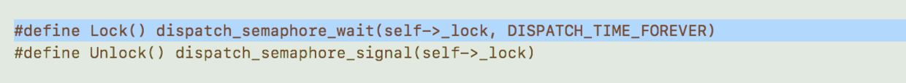
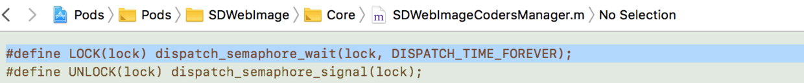
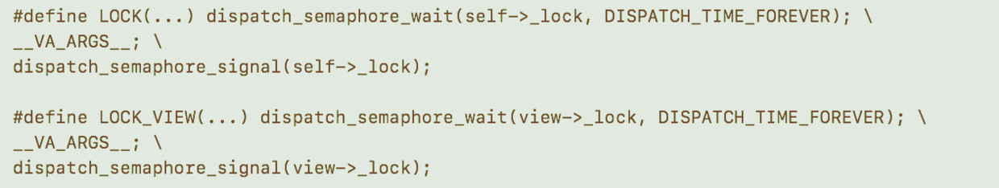

## 几个第三方框架关于线程锁的封装小技巧

**作者**: [陈满iOS](https://weibo.com/cimer)

### 启示

第三方库中经常用到的这个小技巧，例如 `YYCache`，`SDWebImage` 等等，虽然各自封装的具体形式不太一样。

- YYCache



- SDWebImage



- YYWebImage



我们可以借鉴到自己的项目中，在适当的位置通过宏来加锁解锁操作。

### 使用

#### 1. YYCache 版本的宏封装

```objc
#define Lock() dispatch_semaphore_wait(self->_lock, DISPATCH_TIME_FOREVER)
#define Unlock() dispatch_semaphore_signal(self->_lock)
```

- 操作数据之前，先外面进行加锁解锁

```objc
- (NSInteger)totalCount {
	Lock();
	int count = [_kv getItemsCount];
	Unlock();
	return count;
}
```

- 锁里面再进行真正的数据操作

```objc
- (int)getItemsCount {
	return [self _dbGetTotalItemCount];
}
```

#### 2. SDWebImage版本的宏封装

- 定义

```objc
#define LOCK(lock) dispatch_semaphore_wait(lock, DISPATCH_TIME_FOREVER);
#define UNLOCK(lock) dispatch_semaphore_signal(lock);
```

- 调用示例

```objc
- (void)setValue:(nullable NSString *)value forHTTPHeaderField:(nullable NSString *)field {
	LOCK(self.headersLock);
	if (value) {
		self.HTTPHeaders[field] = value;
	} else {
		[self.HTTPHeaders removeObjectForKey:field];
	}
	UNLOCK(self.headersLock);
}
```

其中，`self.headersLock` 的定义为：

```objc
@property (strong, nonatomic, nonnull) dispatch_semaphore_t headersLock; 
```

#### 3. YYWebImage版本的宏封装

相对于上面，还有更方便的宏封装，把解锁操作跟加锁封装在一块。

- 宏定义

```objc
#define LOCK(...) dispatch_semaphore_wait(self->_lock, DISPATCH_TIME_FOREVER); \
__VA_ARGS__; \
dispatch_semaphore_signal(self->_lock);

#define LOCK_VIEW(...) dispatch_semaphore_wait(view->_lock, DISPATCH_TIME_FOREVER); \
__VA_ARGS__; \
dispatch_semaphore_signal(view->_lock);
```

- 使用示例

```objc
- (void)didReceiveMemoryWarning:(NSNotification *)notification {
	[_requestQueue cancelAllOperations];
	[_requestQueue addOperationWithBlock: ^{
		_incrBufferCount = -60 - (int)(arc4random() % 120); // about 1~3 seconds to grow back..
		NSNumber *next = @((_curIndex + 1) % _totalFrameCount);
		LOCK(NSArray * keys = _buffer.allKeys;
			for (NSNumber * key in keys) {
				if (![key isEqualToNumber:next]) { // keep the next frame for smoothly animation
					[_buffer removeObjectForKey:key];
				}
			}
		)//LOCK
	}];
}
```

