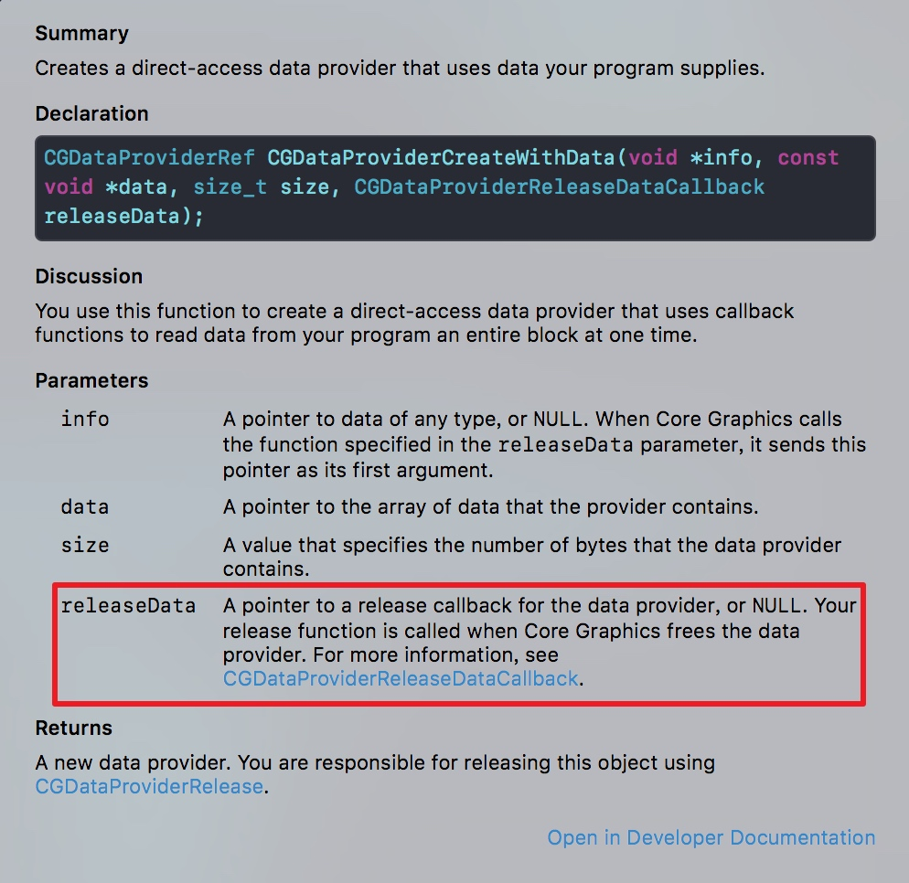
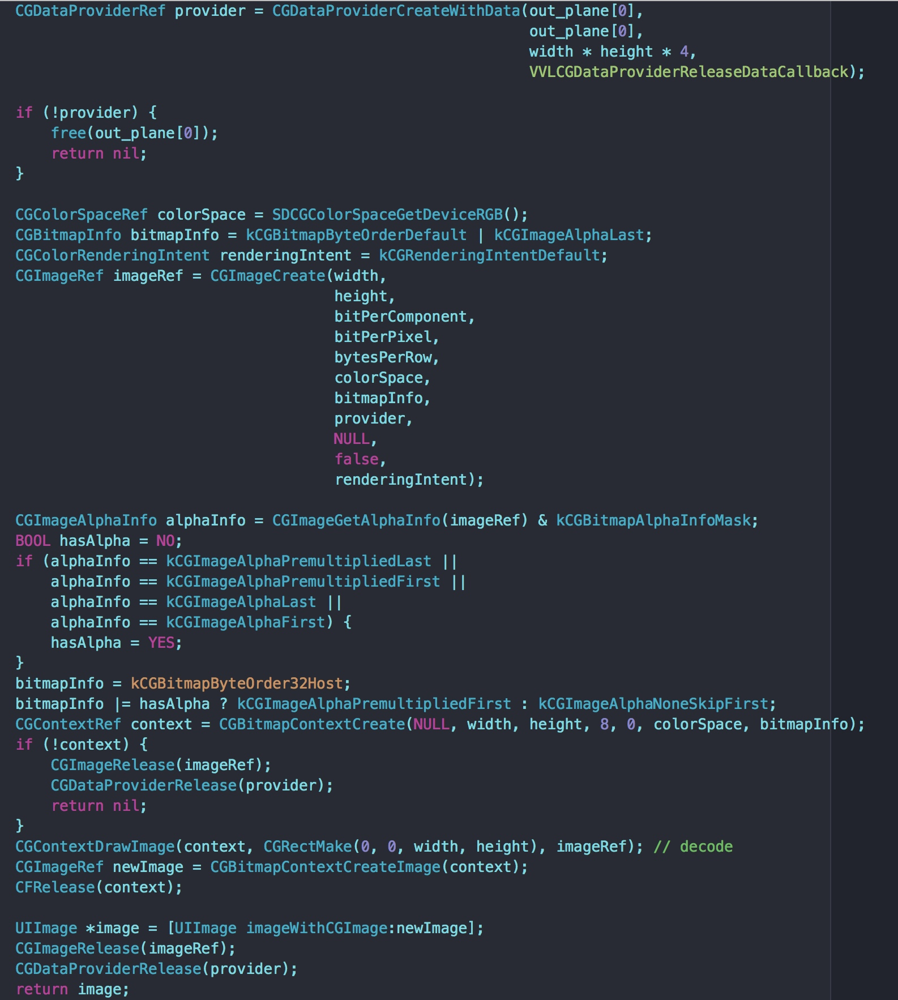

## CGDataProviderCreateWithData 的内存管理

**作者**: [Vong_HUST](https://weibo.com/VongLo)

前段时间在做自定义图片格式解码的时候遇到一个问题，在读取到自定义图片的数据后，需要使用 `CGDataProviderCreateWithData` 将其中的数据读取到 `provider` 中，然后再用这个 `provider` 去创建一个 `CGImageRef`。按照以往经验在拿到 `provider` 之后，需要 `free` 掉之前读取的那一份数据。嗯，写起来大概像图1这样子，看起来没毛病，但是跑起来之后，会发现显示出来的图片会花屏。然后查看这个函数的 API 说明，如图2，也就是说在调用这个函数的时候，需要传一个函数指针进去，这个函数指针会在 `provider` 被释放的时候调用。从侧面可以看出，`CoreGraphics` 在使用 `provider` 去绘制图片时，对图片原始数据应该只是做了一个简单的引用，如果调用完之后就立即 `free` 原始数据，会导致渲染时发生无法预知的错误（比如花屏）。所以需要塞一个回调给创建方法，等到图片真正渲染完之后再释放原始数据，所以只需要写一个简单的回调函数，然后塞给 `create` 函数的最后一个参数即可，如图3所示，然后跑起来一切正常。

由于是在 feed 页，所以滑动过多封面的时候内存高涨不下，而且刚刚说到的释放函数回调的次数比加载的图片张数要少非常多。这个时候想起来会不会是因为用这种方式创建的图片是只有在显示的时候才会解码，这样就可能导致内存无法及时释放，那么自己先强行解码（使用 `CGContextDrawImage` 方法）是不是可以的呢？答案确实是可以的，最终代码如图4所示。这样之后，图片的原始数据也会及时的释放，内存压力骤降。``

