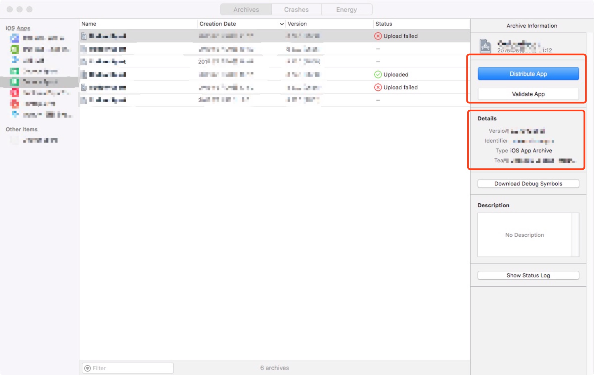
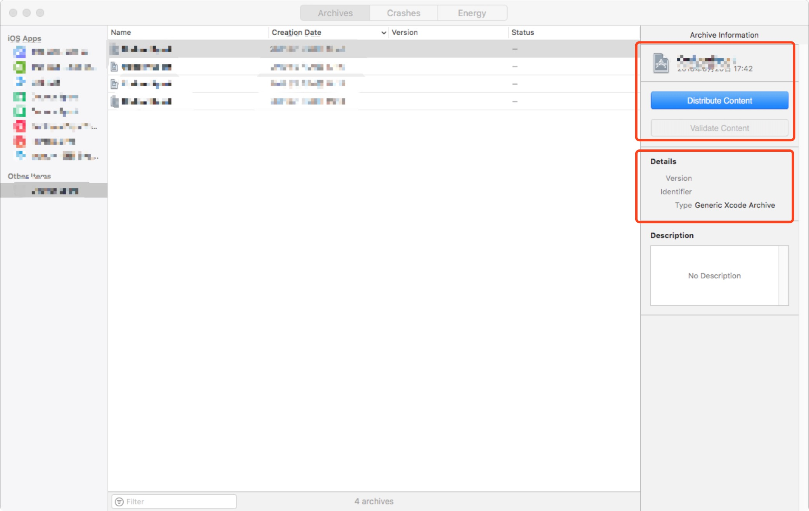
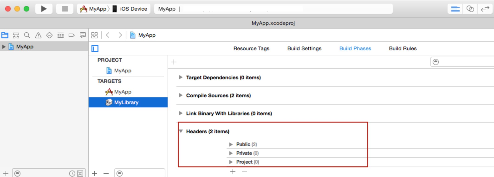

## 关于 Xcode Archive 后 App 出现在 Other Items 分组里的解决办法

**作者**: [高老师很忙](https://weibo.com/517082456)

最近打包时遇到，Archive 成功后 App 出现在了 `Other Items` 分组里，而非原来的 iOS Apps 下面对应的 App 里，并且 `Validate` 处于禁用状态，无法导出 `ipa` 和上传 `AppStore`。同时，使用 `xcodebuild` 进行打包时提示 

```
exportArchive: exportOptionsPlist error for key 'method': expected one of {}, but found enterprise。
```

这是因为出现了某些问题，导致打包生成的 `xcarchive` 文件是 `Generic` 类型，





苹果文档给出的错误原因有：

* 所依赖的静态库的 `Skip Install` 需要为 YES，主 Target 要为 NO。
* 如果在所依赖的静态库的使用了 `Header build phase`（图3）



在 Xcode Archive 时，静态库的 `Header build phase` 会异常，可以删除`Header build phase`，使用 `Copy Files`；或者把Public下面的头文件放到 Project 里。可以通过查看 `xcarchive/Products` 目录是否只有 `Application` 目录进行确认是否因为这个问题引起。

#### 参考链接

[Troubleshooting Application Archiving in Xcode](
https://developer.apple.com/library/archive/technotes/tn2215/_index.html)

