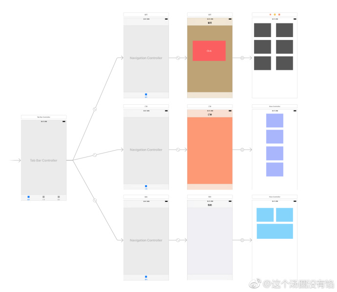
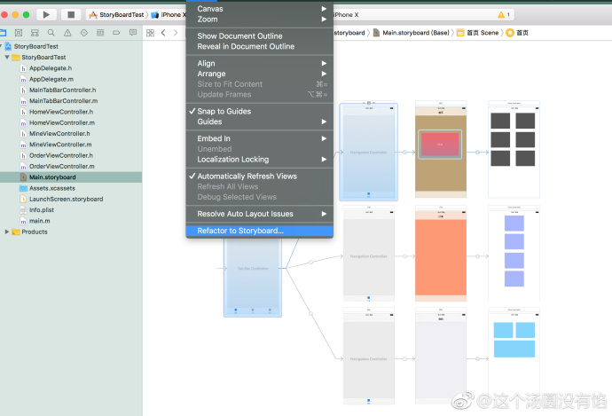
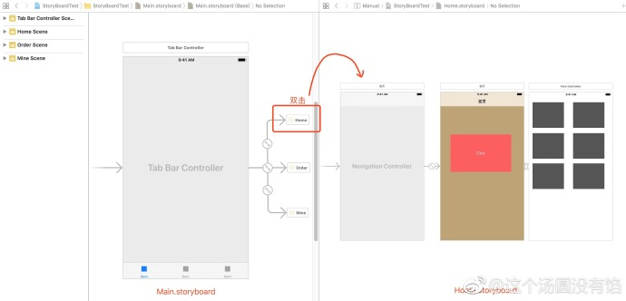

## 利用 Storyboard Reference 给 storyboard 瘦身

**作者：**这个汤圆没有馅

之前在 CocoaChina 论坛上，有一篇帖子关于纯代码还是 `storyboard` 开发吵得不可开交。萝卜青菜各有所爱，希望大家别在这里引发争论，我害怕躺枪[允悲]。对于多人开发项目，`storyboard` 会导致版本管理产生冲突，`Storyboard Reference` 就可以给 `storyboard` 瘦身，使 `storyboard` 更加清晰简洁，减少冲突，方便维护。

`Storyboard Reference` 这个功能是 iOS 9 之后推出的，具体可查看 WWDC 2015 视频前 20分钟：[https://developer.apple.com/videos/play/wwdc2015/215/](https://developer.apple.com/videos/play/wwdc2015/215/)

假使有一个项目，`rootVC` 是一个 `tabbarController`，包含首页、订单、我的三个模块。在每一个模块下又包含其他 VC，如图一。(ps：实际项目肯定比这个要来的复杂)。原本三个模块的所有 vc 都在一个 Main.storyboard 下，现在需要将三个模块分开。

选中首页下的所有控制器，点击菜单栏的 `Editor -> Refactor to Storyboard`，自定义名字为 `xxx.storyboard`，其他两个模块步骤一样。如图二。

完成操作后 `Main.storyboard` 会变成由三个 `reference` 组成。点击 `reference`，会跳转对应的 `storyboard`。如图三。

另外，也可以手动创建一个新 `storyboard` 添加到 `Main.storyboard` 中，如图四，再在 `Attributes Inspector` 中设置 `Storyboard Reference`。

1. **Storyboard**： 手动创建的新 `storyboard` 的名字，下拉箭头可选择。
2. **Reference ID**：新 `storyboard` 中一个特定的 `sence`，如果置空，初始化 viewController 会加载。
3. **Bundle**：新 `storyboard` 需要用到的 `bundle` 资源文件，如果置空，就会只用源 `storyboard` 的 `bundle`。

