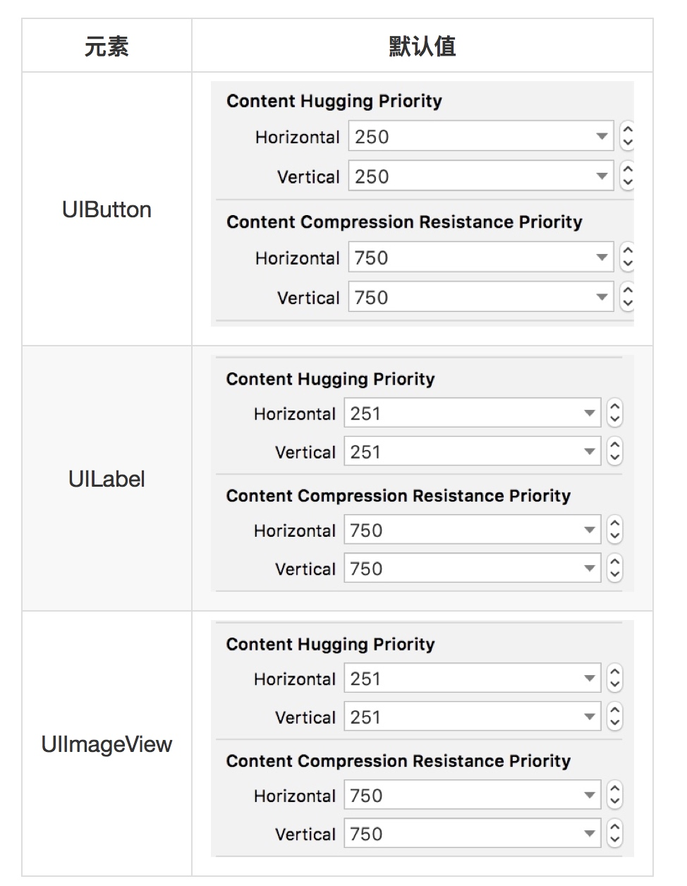

## 聊聊 AutoLayout 的一对属性

**作者**: [Vong_HUST](https://weibo.com/VongLo)

日常开发 `TableViewCell` 左边头像，中间昵称，右边一个关注按钮，具体样式可以看下微博的关注列表的 `cell`。这种布局乍一看很简单，头像，关注按钮固定宽度，然后昵称左右间距一设就搞定了，初看确实没问题，但是如果关注按钮的“关注”两个字要支持多语言，就没法固定宽度了，这时候有人会说直接区分语言，设置不同宽度不就好了吗？对于这种简单的情况，这么做也确实可以，但是如果好几个相似的按钮，处理就变得相对麻烦了，方式也不够优雅。这里介绍一种比较优雅的方式。

像 `UIImageView`、`UILabelL`、`UIButton` 等视图它们是有固有高度的，也就是它会根据自身文字/图片内容将自己撑开，但是当他们在一起做布局的时候，就需要对应规则来约束各自内容的展现形式。也就是接下来要分享的两个“属性”：`content hugging priority` 以及 `content compression resistance priority`，意思也就是字面意思。也很容易理解，前者是视图区域比固有区域要大时，在上述例子中就是 `cell` 水平方向，除去3个 UI 元素外还有剩余的空间，这个时候水平方向 `content hugging` 优先级低的会被拉伸，同理后者就是视图区域比固有区域小时，3个 UI 元素水平方向 `content compression resistance` 优先级低的先被压缩。回到上一个例子，显然我们的头像和按钮是不希望被拉伸也不希望被压缩，所以只能在内容有富余的时候拉伸 `label`，内容不足时压缩 label。竖直方向也同理。
代码如图1所示，值得一提的是，Xib/Storyboard 拖出来的各元素的的两种默认优先级如图2所示，如果是代码创建，则三者默认都是 `hugging = 250`，`compression = 750`。

#### 参考链接

[AUTO LAYOUT MAGIC: CONTENT SIZING PRIORITIES](https://krakendev.io/blog/autolayout-magic-like-harry-potter-but-real)

