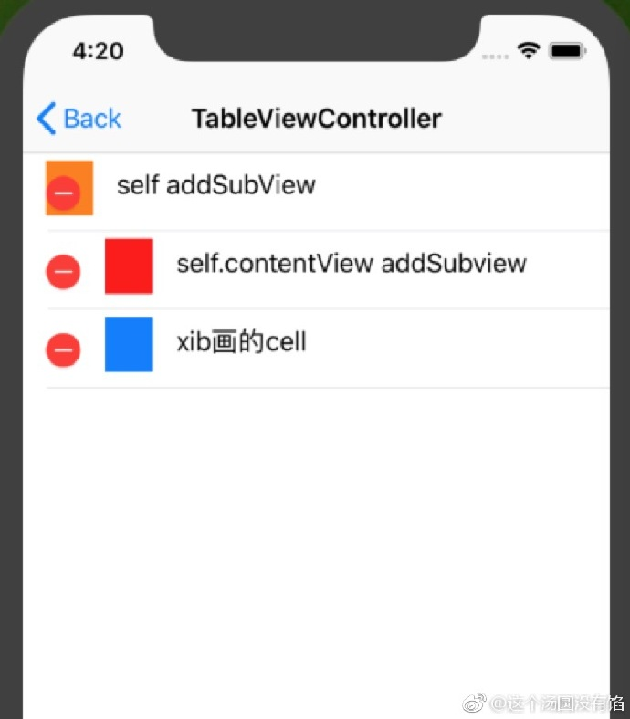
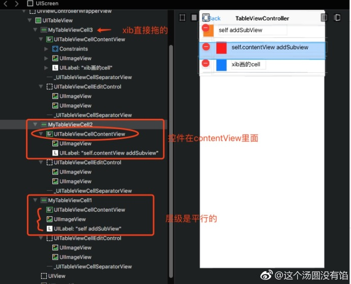

## 自定义 cell 时，[self addSubView] 和 [self.contenView addSubView] 的区别

**作者：这个汤圆没有馅**

之前公司招人面试几位同行的时候，提了如上这么一个问题，但是答上来的人很少。这边跟大家分享一下。

自定义三个 cell，包含 `imgView` 和一个 `label`。

* cell1：使用 `[self addSubView]`；
* cell2：使用 `[self.contentView addSubView]`；
* cell3：使用 xib 直接拖；

Run 以后发现三个 cell 的页面展示完全一样，这个时候，我们设置 `self.tableView.editing = YES`，再次 Run，会发现页面变了，如下图。

`cell2` 和 `cell3` 的展示正常，`cell1` 的展示错乱。我们再到 `Reveal` 里查看下图层，如下图。会发现使用 xib 拖的 cell3，控件都是默认添加在 `contenView` 上。

我们再去官网看下对 cell 的 `contenView` 的解释：

> If you want to customize cells by simply adding additional views, you should add them to the content view so they will be positioned appropriately as the cell transitions into and out of editing mode
> 
> 如果你想要添加额外的 view 来自定义 cell 的时候，你需要将它们添加在 contentView 上，以确保当 cell 切换到编辑模式时它们不会出现错乱。

那么最后的结论就是：如果你的自定义 cell 是不可编辑的，那么使用 `[self addSubView:]` 或 `[self.contentView addSubView:]` 效果是一样的；但是如果是可编辑的，那么就需要使用 `[self.contentView addSubView:]`。

