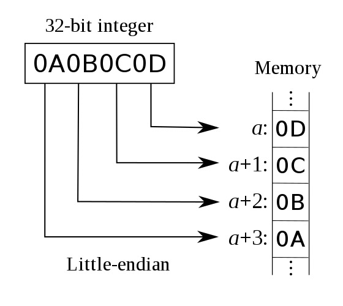
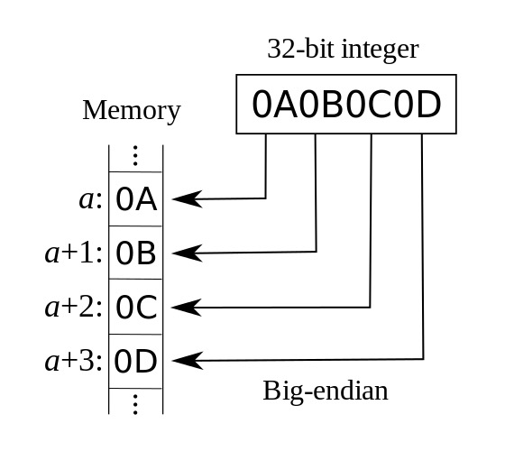
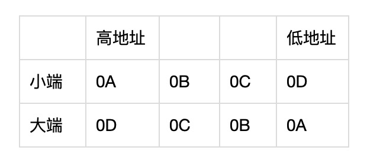

## 简单了解 iOS 大小端以及转换

**作者**: [高老师很忙](https://weibo.com/517082456)

iOS 设备的处理器是基于 ARM 架构的，默认是采用小端模式（低字节放低位，图1）读取数据的，而网络和蓝牙传输数据通常是用的大端模式（低字节放高位，图2）。例如：想传输 ABCD （图3）

按大端模式给到 iOS 客户端是 `DCBA`，那么 iOS 默认读取出来的也是 DCBA，而非 ABCD。所以就需要进行大小端的转换，要不然没办法得到想要的数据。苹果为我们提供了丰富的 API，而不需要让我们对逐个字节进行转换。可以详见[官方文档](https://developer.apple.com/documentation/corefoundation/byte_order_utilities?language=objc)。

通常 iOS 比较常用的就是`CFSwapInt16BigToHost`、`CFSwapInt32BigToHost`，把大端转换为本机支持的模式，如果本机是大端了则不做任何改变。

