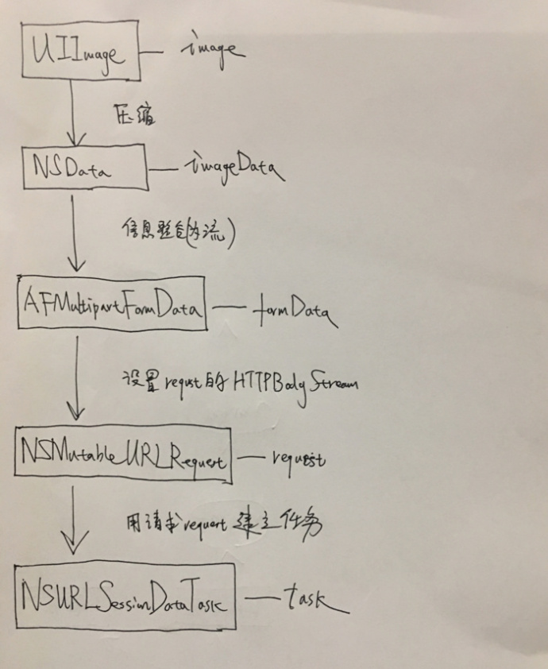

## 比较三种网络框架上传图片过程中的不同点？

**作者**: [陈满iOS](https://weibo.com/cimer)

`AFNetworking` 上传图片的步骤是利用图片设置到 `request` 的 `HTTPBodyStream` 中去，然后利用带有图片的 `request` 新建 `task` 上传。`HYNetworking` 内部实现上传图片的时候，其实就是采用 `AFNetworking` 关于上传图片的 `API`，都是 `AFNetworking` 里面一个 `API`。`XMNetworking` 上传图片请求也是基于 `AFNetworking` 上传进行的封装，不过比 `HYNetworking` 更加隐晦而已，另外它封装了上次图片数组的方法。

### AFNetworking

1. 压缩转换：`UIImage` 实例对象通过 `UIImageJPEGRepresentation` (压缩)转换为 NSData，下面称之为 `imageData`。
2. 信息整合：将 `imageData` 与文件名 `fileName`，文件路径 `name`，类型名 `mimeType` 整合成图片模型（`AFHTTPBodyPart`）的一个对象 `bodyPart` 中去。
3. 添加图片模型：将上面新建好的图片模型对象 `bodyPart`，向图片输入流（`AFMultipartBodyStream`）的对象 `bodyStream` 的数组属性（`HTTPBodyParts`）添加。
4. 设置 `request` 的 `HTTPBodyStream` 属性为 `bodyStream`：封装为 `requestByFinalizingMultipartFormData`
5. 将图片模型对象 `formData` 用 `AFNetwork` 的 `POST` 请求与 `uploadTaskWithStreamedRequest` 方法进行上传。

### HYBNetworking

1. 压缩转换：`UIImage` 实例对象通过 `UIImageJPEGRepresentation` 压缩转换为 `NSData`，下面称之为 `imageData`。
2. 信息整合：利用 `AFNetwork` 的 `appendPartWithFileData`，将 `imageData` 与文件名 `fileName`，文件路径 name，类型名 `mimeType` 整合成图片模型（`AFStreamingMultipartFormData`）的一个对象 `formData` 中去。
3. 将图片模型对象 `formData` 用 `AFNetwork` 的 `POST` 请求与 `uploadTaskWithStreamedRequest` 方法进行上传。

### XMNetworking

1. 压缩转换：`UIImage` 实例对象通过 `UIImageJPEGRepresentation` 压缩转换为 `NSData`，下面称之为 `imageData`。
2. 信息整合：利用 `AFNetwork` 的 `appendPartWithFileData`，将 `imageData` 与文件名 `fileName`，文件路径 `name`，类型名 `mimeType` 整合成图片模型（`XMUploadFormData`）的一个对象 `formData` 中去。
3. 添加图片模型：向管理器的图片模型数组 `uploadFormDatas` 添加上面新建好的图片模型对象 `formData`。
4. 遍历图片模型数组，获得图片模型，利用 `AFNetwork` 的 `POST` 请求与 `uploadTaskWithStreamedRequest` 方法进行上传。

【总结】
可见，上面三种框架都是基于 `AFNetworking` 进行的封装，实质的流程还是一样的。上传图片的流程图如下所示。

