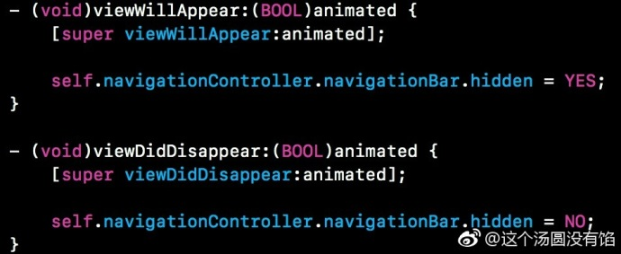
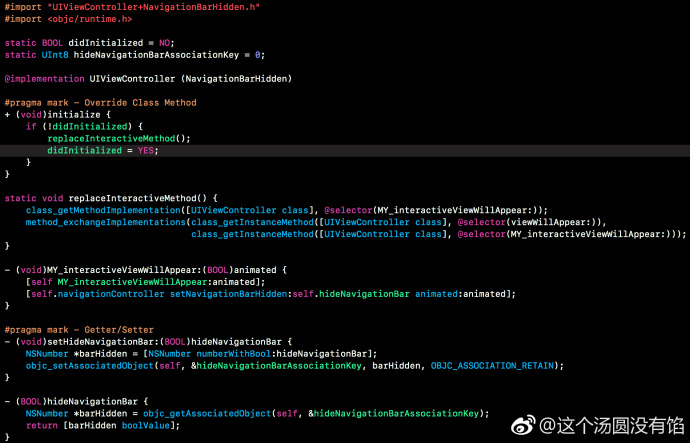
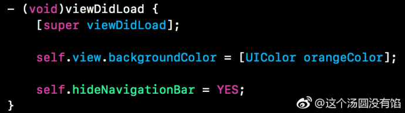

## 通过 runtime 控制导航栏的 hidden 属性

在项目中，有时候会遇到某些个页面需要隐藏导航栏，一般情况下，我们会在 viewWillAppear 和 viewDidDisappear 去设置 navigationBar 的 hidden 属性，如图一。



这里介绍另一种方法，通过 runtime 去控制。

建立 vc 的 category，声明 Bool 类型的 hideNavigationBar 属性。主要思路是：重写 initialize 方法，并且自定义一个方法通过 runtime 去替代系统的 viewWillAppear，在该自定义方法里，就是去设置 navigationBar 的 hidden 属性。具体代码如图二。



代码中用到的几个 runtime 方法简单说明下：

```objc
//获取类中的方法实现
    class_getMethodImplementation
//替换Method
    method_exchangeImplementations
//获取类中的某个实例方法
    class_getInstanceMethod
//关联对象，相当于 setValue:forKey 
    objc_setAssociatedObject
```

关于使用方法，由于 hideNavigationBar 默认是 NO，所以只在需要隐藏导航栏的页面调用即可，代码如图三。



