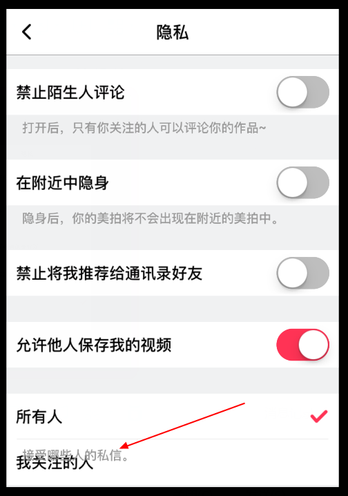

## 静态 UITableView 两种 style 的差异

**作者**: [Vong_HUST](https://weibo.com/VongLo)

想必设置页应该是各大应用所必备的，相信大部分还是采用静态 `UITableView` 的方式在构建，我们项目中也用到了。最近测试反馈一个问题就是一些配置项的描述文案会盖住单元格内容，如图所示。由于之前配置项比较少，所以没有发现，最近新增了好几个配置，所以问题暴露出来了。

图中【接收哪些人】的私信是一个 `SectionFooter`，由于 SectionFooter 是悬停的，内容超过一屏的情况下，SectionFooter 会将单元格挡住，由于 footer 背景是透明的，所以看起来是重叠的。由于 tableView 设置的 style 是 Plain 的，这种情况下 SectionFooter 和 SectionHeader 都是悬停的。如果要想他们不悬停，只需要把 tableView 的 style 设置成 Grouped 即可。

但是需要注意的是 Grouped 样式的 SectionFooter 是自带间隔的，会比 Plain 样式下的 SectionFooter 高 18pt，所以改成 Grouped 样式之后如果要同步 Plain 样式的间隔，这个 `tableView:heightForFooterInSection:` 代理方法返回的高度要减小 18。

