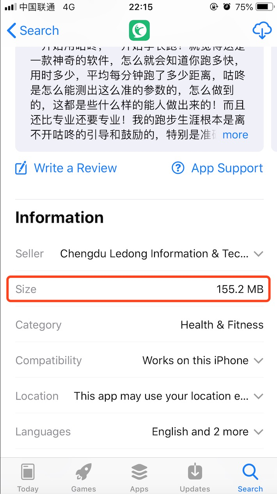
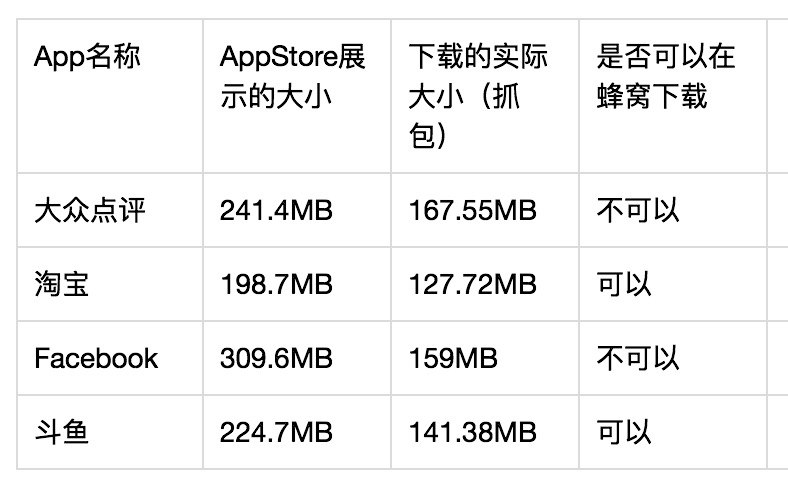
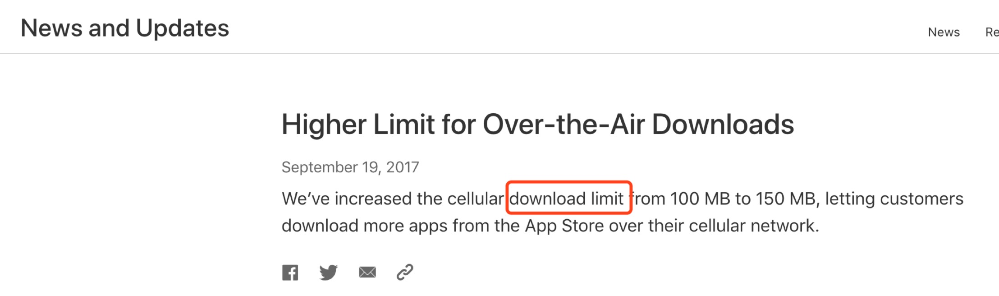
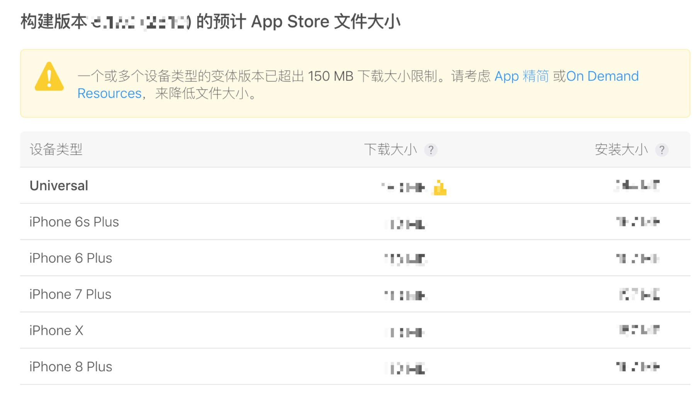

## 对 App Store 在蜂窝网 150MB 的下载限制的理解

**作者**: [高老师很忙](https://weibo.com/517082456)

大家应该都有这样的一个印象：在蜂窝网下，`150MB` 的包在 AppStore 是不能下载的，每当看到 AppStore 下面展示的 Size 接近 150MB 的时候就会很紧张，这意味着又要来一波艰难的减包操作了。

那么这个 150MB 指的是什么呢？是 AppStore 展示的 Size 么？我做了一个小小的调研，发现并非如此，150MB 是包的下载大小，而 AppStore 里展示的 Size 是安装后（有解压操作）的大小，对几个 App 进行了抓包操作:（这个是前段时间的调研，因为版本迭代可能数据会有出入，但足以说明问题）

从苹果之前的官方新闻也能看出端倪:

所以说 AppStore 蜂窝下载限制指的是下载的实际大小而非 AppStore 展示的 Size。

在 ITC 构建版本处理完成后，可以看到详细信息：在各个机型上的下载大小以及安装大小，同时也会提示你是 150MB 下载限制，超过限制还会给你一个黄色警告哦。

减包是一个任重而道远的事情，不要等到在 150MB 的危险边缘再去处理哦！

