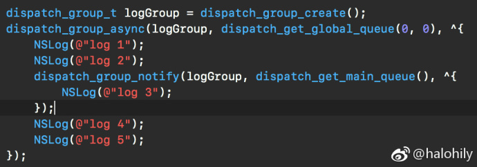
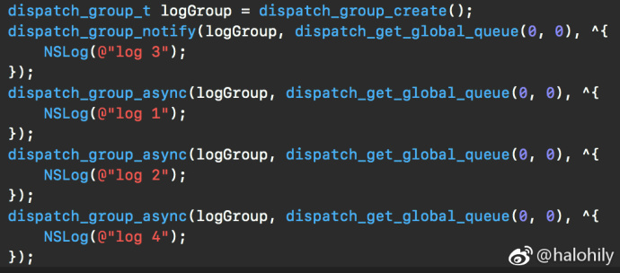

## 一个关于 GCD 分组任务的小 tip

**作者**: [halohily](https://weibo.com/halohily)

在项目中看到一段使用 GCD group 处理的代码，简化下来大概如下图

`dispatch_group_notify` 的调用放在了 `dispatch_group_async` 的 block 中，乍一看会有是否产生永久阻塞的疑问，因为子任务完成后的派发任务被放在了一个子任务中。然而其实这是不会阻塞的，代码会按编写人的预期进行执行，即 log1 输出之后，输出 log2。这是因为 `dispatch_group_notify` 的 block 是异步执行的。

再举个例子，如下图，执行结果依次会是：log 1，log 2 ，log 4 ，log 5 ，log 3。

虽然此处结果正确，但这种将 `dispatch_group_notify` 的调用放在某一个子任务的执行块中的写法是不被推荐的，它不但反逻辑，而且并不总能保证结果正确。比如如果在此例中，在调用了 `dispatch_group_notify` 的子任务之后，又为该任务组使用 `dispatch_group_async` 语句添加后续子任务，这时代码的执行结果是不确定的。

既然最开始的例子中执行结果是正确的，有的同学会问，如果把 `dispatch_group_notify` 的调用放在所有子任务的最前面，如下图，是否也能获得预期的结果呢？答案是否定的，因为在最开始调用 `dispatch_group_notify` 时，子任务数量为0，它的代码块会立即执行。而后为该组派发了多个子任务，当这些子任务都执行完毕后，也并不会再次触发 `dispatch_group_notify` 的代码块。

