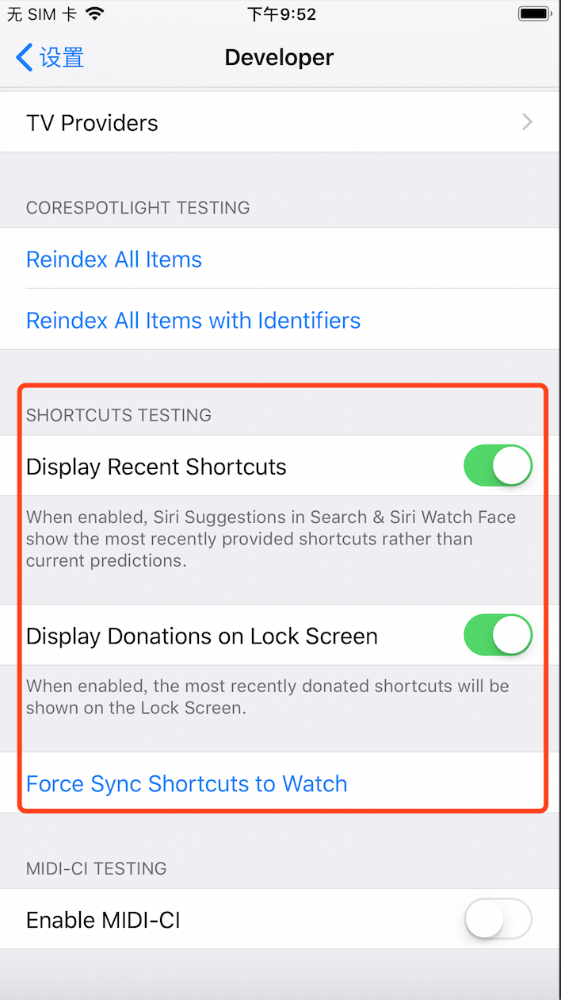

## 提高Shortcuts调试效率的小技巧

**作者**: [高老师很忙](https://weibo.com/517082456)

iOS12提供了 `Shortcuts` 的功能，今天给大家介绍 2 个苹果提供的提高 Shortcuts 调试效率的小技巧。

* Shortcuts 是可以通过 Siri 唤起的，如果每次调试的时候都要和 Siri 说一次短语，既浪费时间又打扰旁边正在工作的同事，Xcode 提供了 Siri Intent Query 功能，在调试 Intents Extension 或者 Intens UI Extension 的 target 时，直接在里面输入你要说的短语，就可去省去调戏 Siri 的时间啦。

* 在 `iPhone设置`->`开发者` 里面提供了 Display Recent Shorts 和 Display Donations on Lock Screen 的开关，可以忽略系统当前的建议和预测，显示我们需要调试的 Shortcuts；同时还支持 Force Sync Shortcuts to Watch 的功能，手动去强制同步到 Watch，会节省很多时间哦！

我觉得这2个小技巧还是很实用的，如果有其它小技巧欢迎一起交流！

