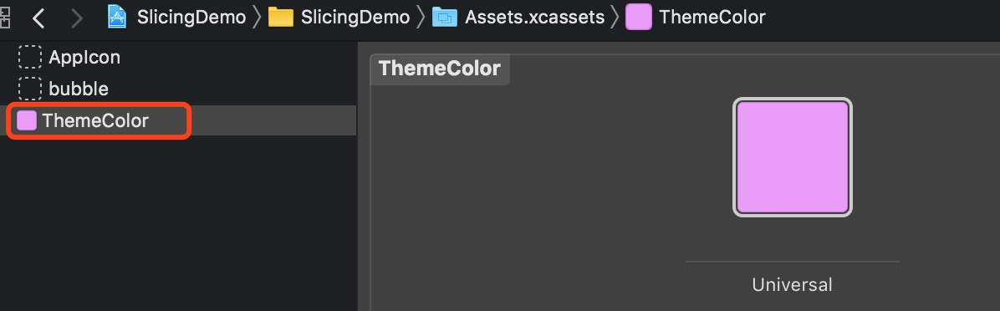
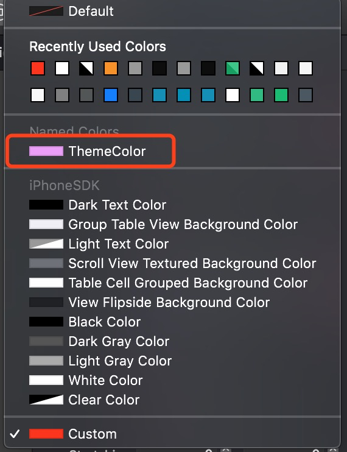
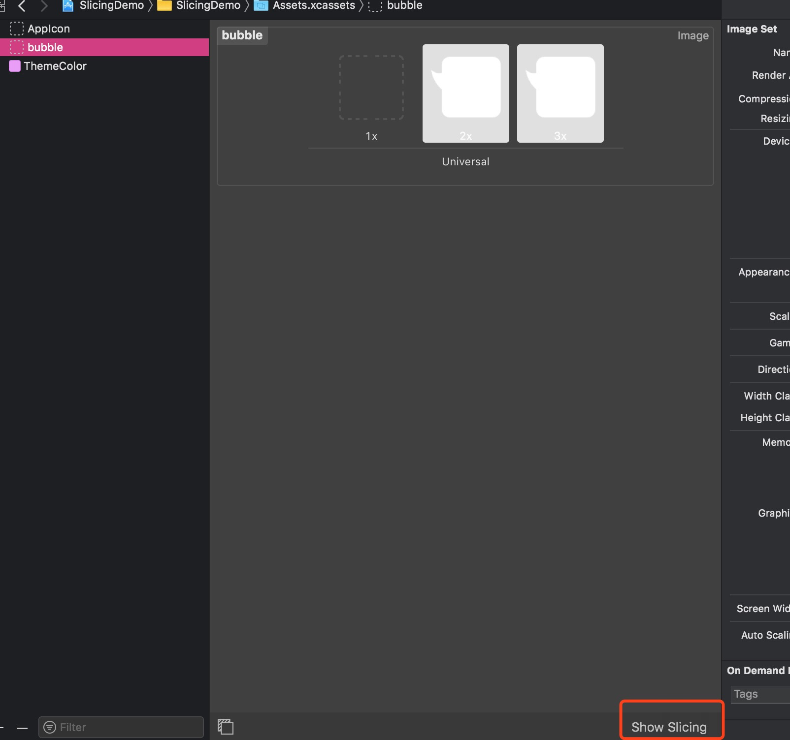
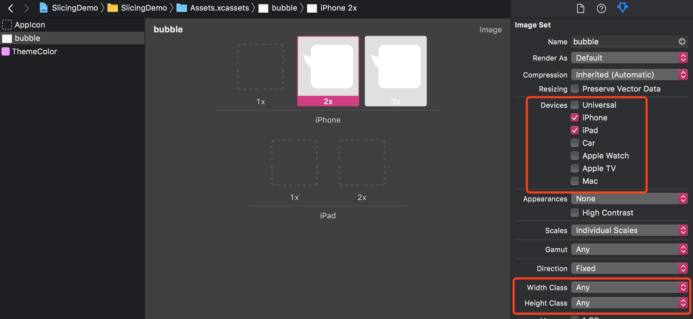

## Assets的几个方便用法

**作者**: [高老师很忙](https://weibo.com/517082456)

Assets 想必大家都使用过，今天聊几个 Assets 比较方便的用法。

1) 在工程中，某个通用的颜色，我们可能会用宏或者全局变量来表示，这样可以方便大家的使用，但有一个弊端，在 `storyboard` 或者 `xib` 布局的时候，设置颜色依旧要去设置具体的RGB值；而Assets给我们提供了一个很方便的功能，可以创建 `New Color Set`，就弥补了刚才方案的缺陷（如下图），并且代码中使用也很方便。

2) 在需要拉伸图片的时候，通常会使用 UIImage 的 API 的`-[UIImage  resizableImageWithCapInsets:resizingMode:]`这个方法；而 Assets 为我们提供了 Slicing 的功能（如下图），在 Assets 中直接设置后，在 storyboard 和 xib 中就可以直接显示拉伸后的图片，在代码中使用也及其方便，直接用 `-[UIImage imageNamed:]` 方法即可。

3) 如果是 Universal 的工程，同一个 UIImageView，在 iPhone 中显示图片 A，在 iPad 中显示图片 B，Assets 可以很方便的通过 `Devices` 设置，会让代码看着很清爽，不会存在判断机型再去设置图片的恶心代码。在设置横竖屏的时候也可以充分利用 `Width Class` 和 `Height Class` 两个参数（如下图）。

我觉得这 3 个用法在工作中还是很实用的，当然 Assets 还有其他很好用的功能，欢迎大家一起交流。

